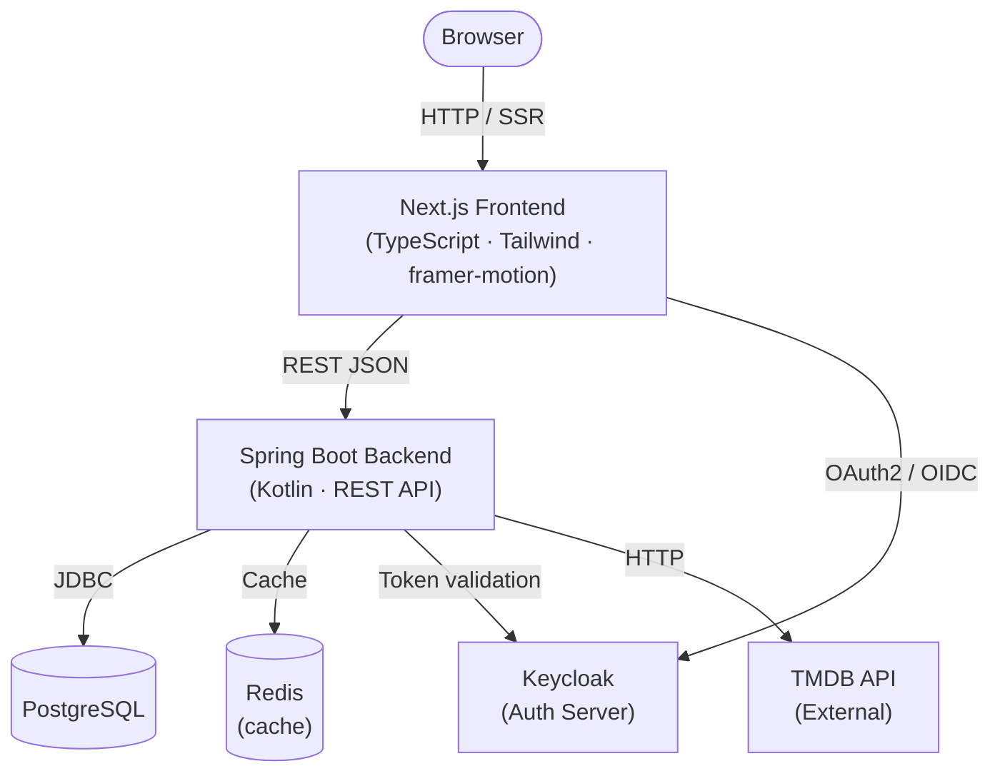
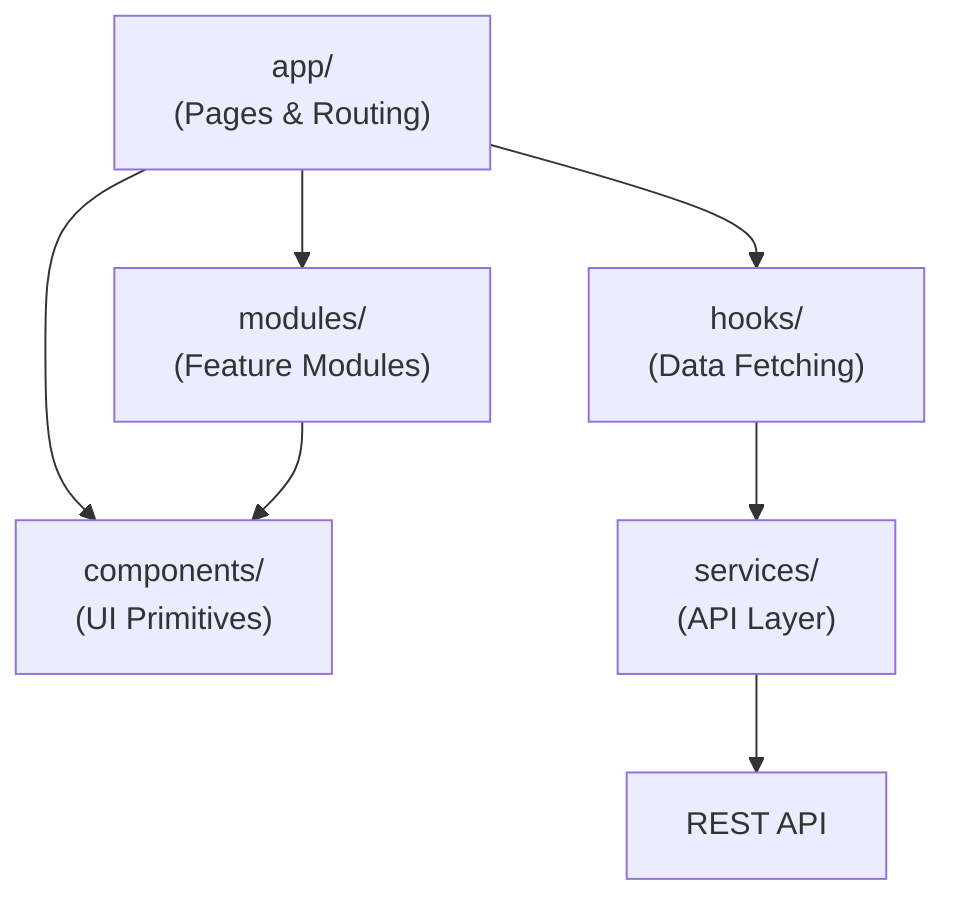
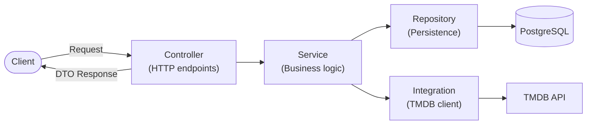

# System Architecture

## Architectural Style

The system follows a modular architecture with separation between:

- Presentation Layer (Frontend)
- Application Layer (Backend services)
- Data Layer (Database)
- Infrastructure Layer

## System Overview

## Frontend Architecture

The frontend is built using Next.js with a modular component architecture.

Key principles:

- Reusable UI components
- Separation of UI and business logic
- Service layer for API communication
- Feature-based module organization

## Backend Architecture

The backend is built using Kotlin and Spring Boot following a layered architecture.

## External Integrations

TMDB API

Used for retrieving:

- movie metadata
- genres
- ratings
- movie descriptions
