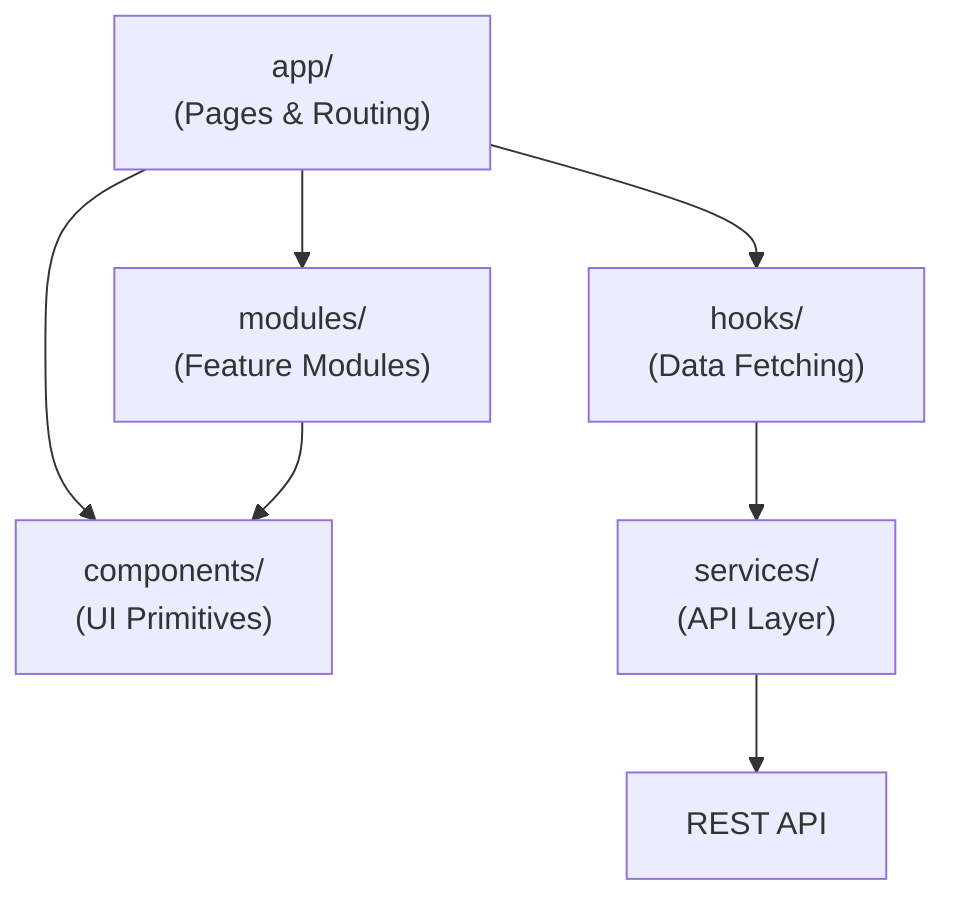
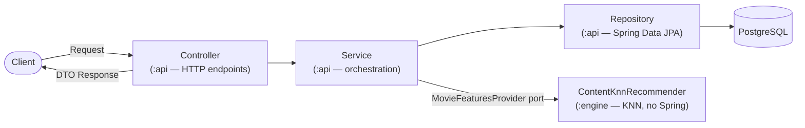

# System Architecture

> **Academic project — temporary, non-commercial.** Not a production service and not affiliated with any movie studio, streaming provider, or TMDB. See the [README](../README.md) for the full disclaimer.

## Architectural Style

The system follows a modular architecture with separation between:

- Presentation Layer (Frontend)
- Application Layer (Backend services)
- Data Layer (Database)
- Infrastructure Layer

## System Overview

```mermaid
graph TD
  Browser([Browser])
  Frontend["Next.js Frontend + BFF\n(TypeScript · Tailwind · framer-motion)"]
  Backend["Spring Boot Backend\n(Kotlin · REST API)"]
  PG[("PostgreSQL")]
  Redis[("Redis\n(recommendation cache)")]
  AuthRedis[("auth-redis\n(BFF sessions)")]
  Keycloak["Keycloak\n(Auth Server)"]

  Browser -->|HTTP / SSR| Frontend
  Browser -->|OAuth2 / OIDC redirect| Keycloak
  Frontend -->|REST JSON via BFF proxy| Backend
  Frontend -->|token exchange / sessions| Keycloak
  Frontend -->|session store| AuthRedis
  Backend -->|JDBC| PG
  Backend -->|Cache| Redis
  Backend -->|Token validation (JWKS)| Keycloak
```

> Movie data is **not** fetched from any live API at runtime — it is imported
> once from the Kaggle TMDB dataset by the seeder. The system is fully offline
> after that initial seed.

> **Keycloak + BFF status:** both edges are live. The frontend is a **Backend-for-Frontend** — `app/api/auth/*` runs the OAuth2 Authorization Code + PKCE flow server-side, and stores token bundles in a dedicated Redis (`auth-redis`, also in `docker-compose.yml`, separate from the recommendation cache). The browser holds only an opaque 32-byte session id in a single cookie; tokens never reach client JS. `app/api/proxy/[...path]` forwards calls from the browser to Spring Boot with `Authorization: Bearer <access>` attached server-side, with auto-refresh on 401. Session payloads in Redis are envelope-encrypted (AES-256-GCM) — separates "Redis access" from "ability to read tokens". Backend enforces JWT on personal endpoints (`/api/ratings/*`, `/api/favorites/*`, `/api/recommendations`); catalog reads (`/api/movies/*`, `/api/recommendations/similar`) stay public. See [`backend.md → Keycloak`](./backend.md#keycloak-auth-provider) and [`frontend.md → Auth (BFF + opaque session)`](./frontend.md#auth-bff--opaque-session).

## Frontend Architecture

The frontend is built using Next.js with a modular component architecture.

Key principles:

- Reusable UI components
- Separation of UI and business logic
- Service layer for API communication
- Feature-based module organization



## Backend Architecture

The backend is a Kotlin + Spring Boot application structured as a **Gradle multi-module monorepo** under `backend/`. Two modules: `:api` (Spring Boot REST layer) and `:engine` (KNN algorithm, pure Kotlin). Convention plugins in `buildSrc/` enforce consistent compiler flags and dependency management. All dependency versions are centralised in `backend/gradle/libs.versions.toml`.

For the variables consumed by the recommender (movie features, user signal, rejected variables) see [`recommender-model.md`](./recommender-model.md).



The `RecommendationService` (`:api`) feeds the `:engine` KNN recommender through
the `MovieFeaturesProvider` port — `:engine` has no Spring or persistence
dependency. See [`recommender-model.md`](./recommender-model.md).

## Data Source

Movie data comes from the **Full TMDB Movies Dataset** on Kaggle, imported once
by the seeder (`SeedMoviesRunner`) into PostgreSQL. The seeder also filters out
titles flagged `adult`. The **backend** makes no runtime calls to TMDB or any
external API after the seed; the one runtime external fetch is the **browser**
loading poster images from TMDB's image CDN (`image.tmdb.org`).

## Deployment

The whole ecosystem deploys to Railway as six services — frontend and Keycloak
public, the backend and the three data stores private. See
[`deployment.md`](./deployment.md) for the full runbook.
