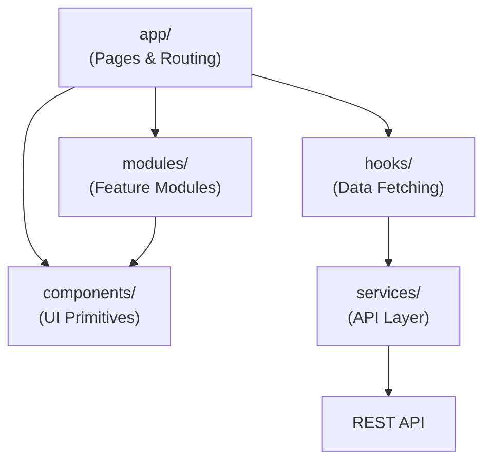

# System Architecture

> **Academic project — temporary, non-commercial.** Not a production service and not affiliated with any movie studio, streaming provider, or TMDB. See the [README](../README.md) for the full disclaimer.

## Architectural Style

The system follows a modular architecture with separation between:

- Presentation Layer (Frontend)
- Application Layer (Backend services)
- Data Layer (Database)
- Infrastructure Layer

## System Overview

> **Keycloak status:** runs as a real service in `docker-compose.yml` (image `quay.io/keycloak/keycloak:26.0`, port `8180`) with a pre-imported realm at `infra/keycloak/realm-export.json`. The `Frontend → Keycloak` edge is live (the `/signup` route redirects users through the OIDC Authorization Code + PKCE flow). The `Backend → Keycloak` edge is *configured* (`spring.security.oauth2.resourceserver.jwt.jwk-set-uri` points at the realm) but **not yet enforced** — `SecurityConfig` is `permitAll()` until the JWT-enforcement card lands. See [`backend.md → Keycloak`](./backend.md#keycloak-auth-provider) for setup details.

## Frontend Architecture

The frontend is built using Next.js with a modular component architecture.

Key principles:

- Reusable UI components
- Separation of UI and business logic
- Service layer for API communication
- Feature-based module organization

## Backend Architecture

The backend is a Kotlin + Spring Boot application structured as a **Gradle multi-module monorepo** under `backend/`. Two modules: `:api` (Spring Boot REST layer) and `:engine` (KNN algorithm, pure Kotlin). Convention plugins in `buildSrc/` enforce consistent compiler flags and dependency management. All dependency versions are centralised in `backend/gradle/libs.versions.toml`.

For the variables consumed by the recommender (movie features, user signal, rejected variables) see [`recommender-model.md`](./recommender-model.md).

## External Integrations

TMDB API

Used for retrieving:

- movie metadata
- genres
- ratings
- movie descriptions
