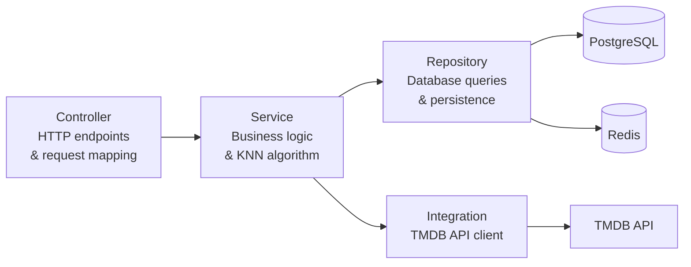
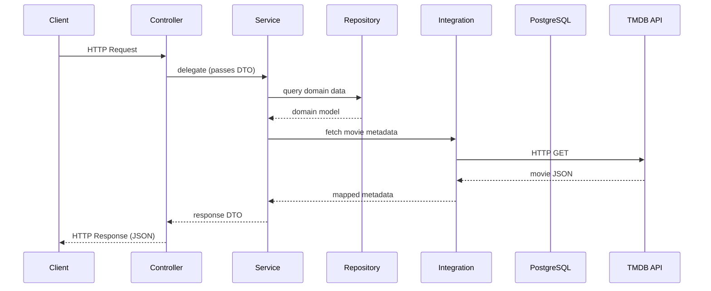

# Backend Architecture

## Technology Stack

- Kotlin
- Spring Boot
- PostgreSQL
- Redis
- Keycloak (authentication)

## Layered Architecture



## Request Lifecycle



## Backend Structure

```
controller/    HTTP endpoints
service/       Business logic
repository/    Persistence
model/         Domain models
dto/           Data transfer objects
config/        Configuration classes
integration/   External API integration (TMDB)
```

## API Style

The backend exposes a REST API.

| Method | Endpoint | Description |
|--------|----------|-------------|
| `GET` | `/api/movies` | Search or list movies |
| `GET` | `/api/movies/{id}` | Movie details |
| `GET` | `/api/recommendations` | KNN-based recommendations |
| `GET` | `/api/users` | User operations |
