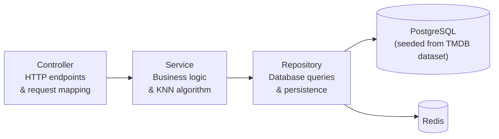
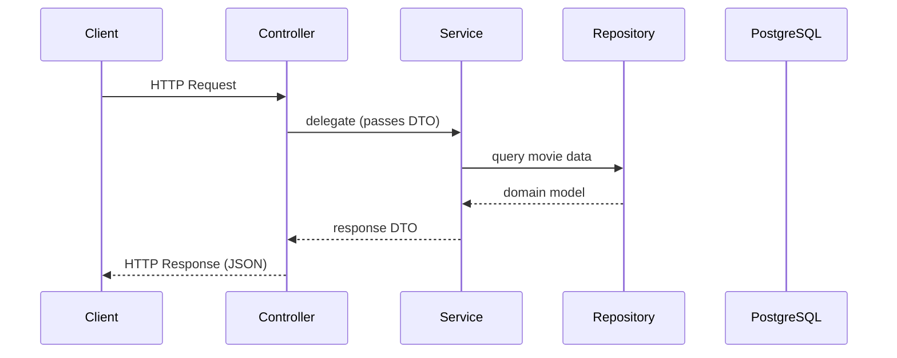

# Backend Architecture

> **Academic project — temporary, non-commercial.** Not a production service and not affiliated with any movie studio, streaming provider, or TMDB. See the [README](../README.md) for the full disclaimer.

> Note: The backend is scaffolded (Spring Boot application boots) but feature implementation is not yet complete. Endpoints and configuration may change during development.

## Technology Stack

- Kotlin · Spring Boot
- PostgreSQL · Flyway (migrations)
- Redis (cache)
- Keycloak (OAuth2 / OpenID Connect)

## Build System

The backend is a **Gradle multi-module monorepo** rooted at `backend/` (Gradle root project: `backend`).

```
backend/
  gradle/
    libs.versions.toml   ← single version catalog (all deps + plugin classpath)
    wrapper/
  buildSrc/
    src/main/kotlin/
      watchtonext.kotlin-conventions.gradle.kts   ← JVM toolchain, group/version, compiler flags, JUnit
      watchtonext.spring-conventions.gradle.kts   ← Spring Boot + Kotlin plugins, base deps
    build.gradle.kts     ← kotlin-dsl; depends on catalog build.* entries
    settings.gradle.kts  ← loads libs catalog from ../gradle/libs.versions.toml
  api/                   ← :api — Spring Boot REST layer; depends on :engine
    build.gradle.kts     ← applies spring-conventions, adds module deps, implementation(projects.engine)
  engine/                ← :engine — KNN recommendation logic, pure Kotlin (no Spring)
    build.gradle.kts     ← applies kotlin-conventions only
  settings.gradle.kts    ← foojay resolver, TYPESAFE_PROJECT_ACCESSORS, include(":api", ":engine")
  gradle.properties      ← JVM args, parallel, caching, configuration-cache
```

### Module responsibilities

| Module | Convention | Depends on | Purpose |
|--------|-----------|------------|---------|
| `:api` | `spring-conventions` | `:engine` | Spring Boot REST layer: controllers, DTOs, config, integrations |
| `:engine` | `kotlin-conventions` | — | KNN algorithm, domain models, pure business logic |

### Version catalog

All versions live in `backend/gradle/libs.versions.toml`. Never hardcode versions in `build.gradle.kts` files — add an entry to the catalog and reference it via `libs.*` accessor.

| Prefix | Purpose |
|--------|---------|
| `build.*` | Plugin classpath only — used exclusively in `buildSrc/build.gradle.kts` |
| `spring.*`, `kotlin.*`, `jackson.*`, `postgresql`, `flyway.*` | Runtime / compile dependencies |
| `kotlin-test-junit5`, `junit-platform-launcher` | Test dependencies |

### Adding a new module

1. Create `backend/<module>/` with a `build.gradle.kts` applying the relevant convention plugin.
2. Add `include(":<module>")` to `backend/settings.gradle.kts`.
3. Reference it as `projects.<module>` (type-safe accessor) from other modules.

## Layered Architecture



## Request Lifecycle



## Backend Structure

```
controller/    HTTP endpoints
service/       Business logic
repository/    Persistence
model/         Domain models
dto/           Data transfer objects
config/        Configuration classes
adapter/       Port implementations (MovieMetadataClient → JPA)
seed/          One-time database seeder (run via ./gradlew :api:dbSetup)
```

## Data

Movie data comes from the [Full TMDB Movies Dataset](https://www.kaggle.com/datasets/asaniczka/tmdb-movies-dataset-2023-930k-movies) (Kaggle, ODC-By license). The system is **fully offline after the initial seed** — no runtime calls to TMDB.

| Step | Command |
|------|---------|
| Download CSV | From Kaggle (see README) — place `TMDB_movie_dataset_v11.csv` at repo root |
| Run Flyway + seed | `./gradlew :api:dbSetup` |

> This product uses the TMDB API but is not endorsed or certified by TMDB.

## Keycloak (auth provider)

Keycloak runs as a real service in `docker-compose.yml` (`quay.io/keycloak/keycloak:26.0`, port `8180:8080`). The realm is provisioned on first boot by bind-mounting `infra/keycloak/realm-export.json` and starting with `start-dev --import-realm`. Subsequent boots **do not** re-import — to apply a changed JSON, wipe the volume: `docker compose down keycloak && docker volume rm watchtonext_keycloak_data && docker compose up -d keycloak`.

| What | Where |
|------|-------|
| Admin console | http://localhost:8180/admin (`admin` / `admin` — dev only, from `backend/.env`) |
| OIDC discovery | http://localhost:8180/realms/watchtonext/.well-known/openid-configuration |
| Realm export | `infra/keycloak/realm-export.json` (gold-standard config, see below) |
| Login theme | `infra/keycloak/themes/watchtonext/` — CSS-only restyle of the stock login pages to match the app (dark zinc + amber). Bind-mounted at `/opt/keycloak/themes`; selected via the realm's `loginTheme`. |
| Health check | `/health/ready` on port `9000` (used by the compose healthcheck) |

### Realm `watchtonext`

- **Registration:** open (`registrationAllowed: true`, `registrationEmailAsUsername: true`); email-as-username, no email verification (no SMTP wired), no password reset flow.
- **Password policy:** `length(12) and upperCase(1) and lowerCase(1) and digits(1) and specialChars(1) and notUsername and notEmail and passwordHistory(3)`.
- **Brute-force protection:** enabled — 5 failures locks the account for 15 minutes (`failureFactor: 5`, `maxFailureWaitSeconds: 900`).
- **Tokens:** 5-minute access token, 30-minute idle SSO session, 10-hour SSO max, refresh-token rotation (`revokeRefreshToken: true`, `refreshTokenMaxReuse: 0`).
- **Events:** user + admin events enabled, 14-day retention — auditable from the admin console.
- **Roles:** realm roles `USER` (default, auto-assigned via the composite `default-roles-watchtonext`) and `ADMIN`.

### Clients

| Client | Type | Purpose |
|--------|------|---------|
| `watchtonext-frontend` | public, PKCE S256 only | Used by the Next.js SPA. Standard flow only — ROPC / implicit / service-accounts all explicitly disabled. Redirect URI `http://localhost:3000/*`. |
| `watchtonext-api` | confidential, bearer-only | Resource server for the Spring Boot backend. Secret in the export is the literal placeholder `dev-only-change-me` — **rotate it via the admin console** in any deployed environment. |

### Deploying to Railway (or similar)

The same image works in production with mode `start --optimized` and these env vars (Postgres reused from the project DB, separate schema):

```
KC_DB=postgres
KC_DB_URL=jdbc:postgresql://<host>:5432/<db>
KC_DB_USERNAME=…
KC_DB_PASSWORD=…
KC_HOSTNAME=<public-fqdn>
KC_PROXY=edge
KC_HTTP_ENABLED=true
KC_BOOTSTRAP_ADMIN_USERNAME=…
KC_BOOTSTRAP_ADMIN_PASSWORD=…
```

The `--import-realm` flag is idempotent — it only imports if the realm doesn't already exist. Safe to leave in the deploy command.

### Token validation in the API

`SecurityConfig` activates `oauth2ResourceServer.jwt()` with the JWK set URI from `application.properties` (`spring.security.oauth2.resourceserver.jwt.jwk-set-uri`). Authorization is selective:

| Endpoint | Auth |
|----------|------|
| `GET /api/movies`, `GET /api/movies/popular`, `GET /api/movies/{id}` | public — catalog browsing |
| `GET /api/recommendations/similar` | public — used by movie detail page |
| `GET /api/recommendations` (personal) | authenticated |
| `PUT/DELETE /api/ratings/{movieId}` | authenticated |
| `PUT/DELETE /api/favorites/{movieId}` | authenticated |
| `OPTIONS /**` | public (CORS pre-flight) |

`config/JwtConverter` extracts realm roles from `realm_access.roles` and maps them to `ROLE_<name>` Spring authorities. `service/UserProvisioningFilter` runs after the Spring Security bearer-token filter and idempotently calls `UserProvisioningService.provision(jwt)` to upsert the `users` row keyed by the JWT `sub`. Failures during provisioning are logged but do not break the request.

On **creation**, `provision()` seeds `displayName` from the JWT claims (`preferred_username` → `name` → synthetic `user-<sub-prefix>` fallback). On **subsequent calls** it only reconciles `email`; `displayName` is owned by the user via `PATCH /api/users/me` and is no longer overwritten from upstream claims. This means a manual rename via `Account Console` in the IdP won't propagate, but the user-driven edit also won't be silently wiped on the next login.

Controllers no longer take `@RequestParam userId`. They read `@AuthenticationPrincipal Jwt jwt` and derive `UUID.fromString(jwt.subject)`. This applies to `RatingController`, `FavoriteController`, and `RecommendationController.recommend()`. `RecommendationController.similar()` stays unauthenticated and has no userId.

## API Style

The backend is planned to expose a REST API with the following endpoints (subject to change during implementation):

| Method | Endpoint | Description |
|--------|----------|-------------|
| `GET`  | `/api/movies?q=&page=&size=`        | **Public.** Paginated title search (`q` required and `@NotBlank`, 1-indexed `page`, `size` ∈ [1,100]). Returns `PageDto<MovieSummaryDto>` ordered by popularity desc. |
| `GET`  | `/api/movies/{id}`                  | **Public.** Movie details — returns `MovieSummaryDto`. 404 when the id is unknown. |
| `GET`  | `/api/movies/popular?page=&size=`   | **Public.** Paginated popular movies (1-indexed `page`, `size` ∈ [1,100]). |
| `GET`  | `/api/recommendations?limit=`       | **Authenticated.** Personalized recommendations (KNN over the caller's ratings; userId from JWT `sub`, `limit` ∈ [1,100]). |
| `GET`  | `/api/recommendations/similar?movieId=&limit=` | **Public.** Movies similar to a given movie (single-seed KNN, excludes the seed, `limit` ∈ [1,100]). 404 when the movie is unknown. |
| `GET`  | `/api/ratings/{movieId}`            | **Authenticated.** Returns `{rating: number\|null}` — the caller's rating for the movie, or `null` when not rated. |
| `PUT`  | `/api/ratings/{movieId}` (body `{rating}`) | **Authenticated.** Upsert a rating for the caller (`rating` ∈ [0.0, 5.0]). |
| `DELETE` | `/api/ratings/{movieId}`          | **Authenticated.** Remove the caller's rating. |
| `GET`  | `/api/favorites`                    | **Authenticated.** Lists the caller's favorites as `FavoriteDto[]` (`{userId, movieId, createdAt}`). |
| `PUT`  | `/api/favorites/{movieId}`          | **Authenticated.** Mark a movie as favorite for the caller (idempotent). |
| `DELETE` | `/api/favorites/{movieId}`        | **Authenticated.** Remove the favorite. |
| `GET`  | `/api/users/me`                     | **Authenticated.** Returns the caller's profile: `{id, displayName, email, createdAt, ratingsCount, favoritesCount, watchedCount}`. User id is taken from the JWT `sub`; defensively calls `UserProvisioningService` before the read. |
| `PATCH` | `/api/users/me` (body `{displayName}`) | **Authenticated.** Updates the caller's editable profile. Only `displayName` is supported (validated `@NotBlank` + length 1..255; server trims whitespace). Email is read-only and comes from Keycloak. Returns the refreshed `UserMeDto`. `UserProvisioningService` no longer overwrites `displayName` on subsequent logins. |
| `PUT`  | `/api/watched/{movieId}`            | **Authenticated.** Marks a movie as watched for the caller (idempotent). Returns `WatchedDto`. 404 when the movie is unknown. |
| `DELETE` | `/api/watched/{movieId}`          | **Authenticated.** Removes the watched mark. |
| `GET`  | `/api/watched/{movieId}`            | **Authenticated.** Returns `{watched: boolean}` for the caller + movie. |

## Errors

Every error response — validation, missing resource, conflict, timeout, unknown route, unsupported method/media type, or an uncaught exception — shares the same `ApiError` JSON shape and a controlled `ErrorEnum` code. See [error-handling.md](./error-handling.md) for the full contract, the catalog of codes, and the rules controllers and services must follow.

## Known boot warnings

These are upstream warnings that show up on every boot and are **not actionable in this codebase**. Documented here so they don't get re-investigated each release:

- `WARNING: sun.misc.Unsafe::allocateMemory has been called by io.netty.util.internal.PlatformDependent0` — emitted by Netty (pulled in transitively by Lettuce, the Redis client). Netty 4.2.x still uses `sun.misc.Unsafe` for off-heap allocation; the Netty team is migrating to the JDK Foreign Memory API and the warning will disappear once that lands and Spring Boot bumps its managed version. No behavior impact.
