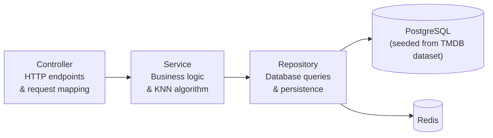
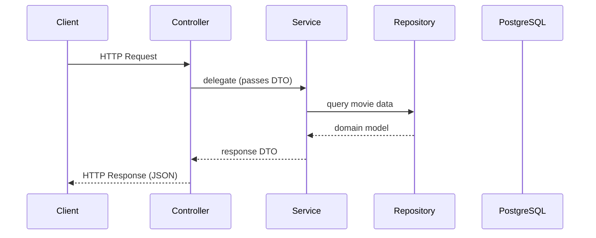

# Backend Architecture

> Note: The backend is scaffolded (Spring Boot application boots) but feature implementation is not yet complete. Endpoints and configuration may change during development.

## Technology Stack

- Kotlin · Spring Boot
- PostgreSQL · Flyway (migrations)
- Redis (cache)
- Keycloak (OAuth2 / OpenID Connect)

## Build System

The backend is a **Gradle multi-module monorepo** rooted at `backend/` (Gradle root project: `backend`).

```
backend/
  gradle/
    libs.versions.toml   ← single version catalog (all deps + plugin classpath)
    wrapper/
  buildSrc/
    src/main/kotlin/
      watchtonext.kotlin-conventions.gradle.kts   ← JVM toolchain, group/version, compiler flags, JUnit
      watchtonext.spring-conventions.gradle.kts   ← Spring Boot + Kotlin plugins, base deps
    build.gradle.kts     ← kotlin-dsl; depends on catalog build.* entries
    settings.gradle.kts  ← loads libs catalog from ../gradle/libs.versions.toml
  api/                   ← :api — Spring Boot REST layer; depends on :engine
    build.gradle.kts     ← applies spring-conventions, adds module deps, implementation(projects.engine)
  engine/                ← :engine — KNN recommendation logic, pure Kotlin (no Spring)
    build.gradle.kts     ← applies kotlin-conventions only
  settings.gradle.kts    ← foojay resolver, TYPESAFE_PROJECT_ACCESSORS, include(":api", ":engine")
  gradle.properties      ← JVM args, parallel, caching, configuration-cache
```

### Module responsibilities

| Module | Convention | Depends on | Purpose |
|--------|-----------|------------|---------|
| `:api` | `spring-conventions` | `:engine` | Spring Boot REST layer: controllers, DTOs, config, integrations |
| `:engine` | `kotlin-conventions` | — | KNN algorithm, domain models, pure business logic |

### Version catalog

All versions live in `backend/gradle/libs.versions.toml`. Never hardcode versions in `build.gradle.kts` files — add an entry to the catalog and reference it via `libs.*` accessor.

| Prefix | Purpose |
|--------|---------|
| `build.*` | Plugin classpath only — used exclusively in `buildSrc/build.gradle.kts` |
| `spring.*`, `kotlin.*`, `jackson.*`, `postgresql`, `flyway.*` | Runtime / compile dependencies |
| `kotlin-test-junit5`, `junit-platform-launcher` | Test dependencies |

### Adding a new module

1. Create `backend/<module>/` with a `build.gradle.kts` applying the relevant convention plugin.
2. Add `include(":<module>")` to `backend/settings.gradle.kts`.
3. Reference it as `projects.<module>` (type-safe accessor) from other modules.

## Layered Architecture



## Request Lifecycle



## Backend Structure

```
controller/    HTTP endpoints
service/       Business logic
repository/    Persistence
model/         Domain models
dto/           Data transfer objects
config/        Configuration classes
adapter/       Port implementations (MovieMetadataClient → JPA)
seed/          One-time database seeder (run via ./gradlew :api:dbSetup)
```

## Data

Movie data comes from the [Full TMDB Movies Dataset](https://www.kaggle.com/datasets/asaniczka/tmdb-movies-dataset-2023-930k-movies) (Kaggle, ODC-By license). The system is **fully offline after the initial seed** — no runtime calls to TMDB.

| Step | Command |
|------|---------|
| Download CSV | From Kaggle (see README) — place `TMDB_movie_dataset_v11.csv` at repo root |
| Run Flyway + seed | `./gradlew :api:dbSetup` |

> This product uses the TMDB API but is not endorsed or certified by TMDB.

## API Style

The backend is planned to expose a REST API with the following endpoints (subject to change during implementation):

| Method | Endpoint | Description |
|--------|----------|-------------|
| `GET`  | `/api/movies`                       | Search or list movies (supports filters/query params) |
| `GET`  | `/api/movies/{id}`                  | Movie details |
| `GET`  | `/api/movies/popular`               | List popular movies (used on home screen) |
| `GET`  | `/api/recommendations`              | Recommendations for a movie (requires `movieId` query parameter) |
| `GET`  | `/api/recommendations/personalized` | Personalized recommendations for the current user |
| `GET`  | `/api/users/me`                     | Fetch the current authenticated user's profile |
| `POST` | `/api/users/me/watched`             | Mark a movie as watched for the current user |

## Errors

Every error response — validation, missing resource, conflict, timeout, unknown route, unsupported method/media type, or an uncaught exception — shares the same `ApiError` JSON shape and a controlled `ErrorEnum` code. See [error-handling.md](./error-handling.md) for the full contract, the catalog of codes, and the rules controllers and services must follow.
