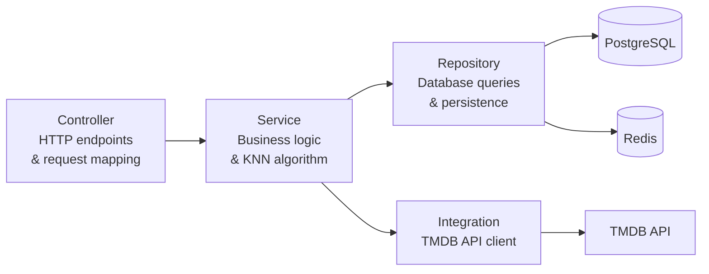
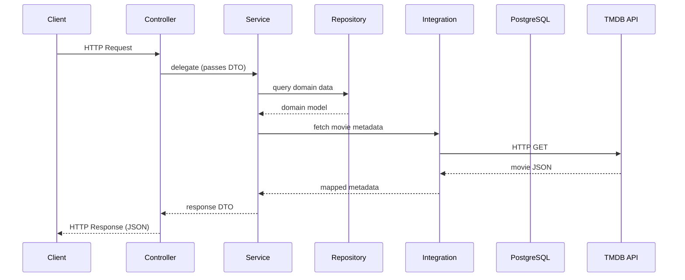

# Backend Architecture

> Note: The backend described here is the **planned/target architecture**. As noted in the root README, the backend implementation is not yet complete, and endpoints/configuration may change during development.

## Technology Stack

- Kotlin
- Spring Boot
- PostgreSQL
- Redis
- Keycloak (authentication)

## Layered Architecture



## Request Lifecycle



## Backend Structure

```
controller/    HTTP endpoints
service/       Business logic
repository/    Persistence
model/         Domain models
dto/           Data transfer objects
config/        Configuration classes
integration/   External API integration (TMDB)
```

## API Style

The backend is planned to expose a REST API with the following endpoints (subject to change during implementation):

| Method | Endpoint | Description |
|--------|----------|-------------|
| `GET`  | `/api/movies`                       | Search or list movies (supports filters/query params) |
| `GET`  | `/api/movies/{id}`                  | Movie details |
| `GET`  | `/api/movies/popular`               | List popular movies (used on home screen) |
| `GET`  | `/api/recommendations`              | Recommendations for a movie (requires `movieId` query parameter) |
| `GET`  | `/api/recommendations/personalized` | Personalized recommendations for the current user |
| `GET`  | `/api/users/me`                     | Fetch the current authenticated user's profile |
| `POST` | `/api/users/me/watched`             | Mark a movie as watched for the current user |
