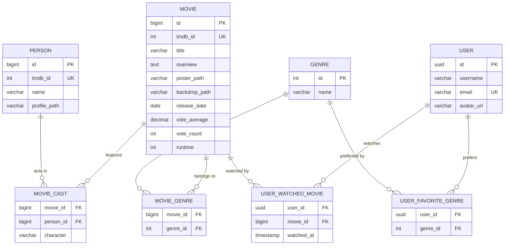

# ER & Class Diagrams

> **Academic project — temporary, non-commercial.** Not a production service and not affiliated with any movie studio, streaming provider, or TMDB. See the [README](../README.md) for the full disclaimer.

> These diagrams reflect the **planned backend design** derived from the frontend type definitions, API contracts, and architecture docs.

---

## ER Diagram

---

## Class Diagram

```mermaid
classDiagram
    %% ── Controllers ──
    class MovieController {
        +getMovies(query, page) PaginatedResponseDTO~MovieDTO~
        +getMovieById(id) MovieDetailsDTO
        +getPopularMovies(page) PaginatedResponseDTO~MovieDTO~
    }
    class RecommendationController {
        +getRecommendations(movieId) List~MovieDTO~
        +getPersonalized() List~MovieDTO~
    }
    class UserController {
        +getProfile() UserProfileDTO
        +addWatched(movieId) void
    }

    %% ── Services ──
    class MovieService {
        +findAll(query, page) PaginatedResponse~Movie~
        +findById(id) MovieDetails
        +findPopular(page) PaginatedResponse~Movie~
        +findByGenre(genreId, page) PaginatedResponse~Movie~
    }
    class RecommendationService {
        +getForMovie(movieId) List~Movie~
        +getPersonalized(userId) List~Movie~
    }
    class KnnService {
        +buildFeatureVector(movie) DoubleArray
        +findKNearest(target, candidates, k) List~Movie~
        -cosineSimilarity(a, b) Double
    }
    class UserService {
        +getProfile(userId) UserProfile
        +addWatchedMovie(userId, movieId) void
    }

    %% ── Repositories ──
    class MovieRepository {
        +findById(id) Optional~Movie~
        +findByTmdbId(tmdbId) Optional~Movie~
        +findAllByGenre(genreId, pageable) Page~Movie~
        +findPopular(pageable) Page~Movie~
    }
    class UserRepository {
        +findById(id) Optional~User~
        +findByEmail(email) Optional~User~
    }
    class GenreRepository {
        +findAll() List~Genre~
    }

    %% ── Domain Models ──
    class Movie {
        +Long id
        +Int tmdbId
        +String title
        +String overview
        +String posterPath
        +String backdropPath
        +LocalDate releaseDate
        +Double voteAverage
        +Int voteCount
        +Int runtime
        +List~Genre~ genres
    }
    class Genre {
        +Int id
        +String name
    }
    class Person {
        +Long id
        +Int tmdbId
        +String name
        +String profilePath
    }
    class MovieCast {
        +Movie movie
        +Person person
        +String character
    }
    class User {
        +UUID id
        +String username
        +String email
        +String avatarUrl
        +List~Movie~ watchedMovies
        +List~Genre~ favoriteGenres
    }

    %% ── DTOs ──
    class MovieDTO {
        +Long id
        +String title
        +String overview
        +String posterPath
        +String backdropPath
        +String releaseDate
        +Double voteAverage
        +Int voteCount
        +Int runtime
        +List~GenreDTO~ genres
    }
    class MovieDetailsDTO {
        +List~CastMemberDTO~ cast
        +List~MovieDTO~ similarMovies
    }
    class UserProfileDTO {
        +UUID id
        +String username
        +String email
        +String avatarUrl
        +List~MovieDTO~ watchedMovies
        +List~String~ favoriteGenres
    }
    class PaginatedResponseDTO~T~ {
        +List~T~ content
        +Int totalElements
        +Int totalPages
        +Int currentPage
        +Int pageSize
    }

    %% ── Integration ──
    class TmdbClient {
        +searchMovies(query, page) TmdbSearchResponse
        +getMovieDetails(tmdbId) TmdbMovieResponse
        +getPopularMovies(page) TmdbSearchResponse
    }

    %% ── Relationships ──
    MovieController --> MovieService
    RecommendationController --> RecommendationService
    UserController --> UserService

    MovieService --> MovieRepository
    MovieService --> TmdbClient
    RecommendationService --> KnnService
    RecommendationService --> MovieRepository
    RecommendationService --> UserRepository
    UserService --> UserRepository
    UserService --> MovieRepository

    Movie "1" --> "*" Genre
    Movie "1" --> "*" MovieCast
    MovieCast --> Person
    User "1" --> "*" Movie : watched
    User "1" --> "*" Genre : favorites

    MovieDTO --|> MovieDetailsDTO : extends
    MovieDetailsDTO ..> MovieDTO : contains
    UserProfileDTO ..> MovieDTO : contains
```

