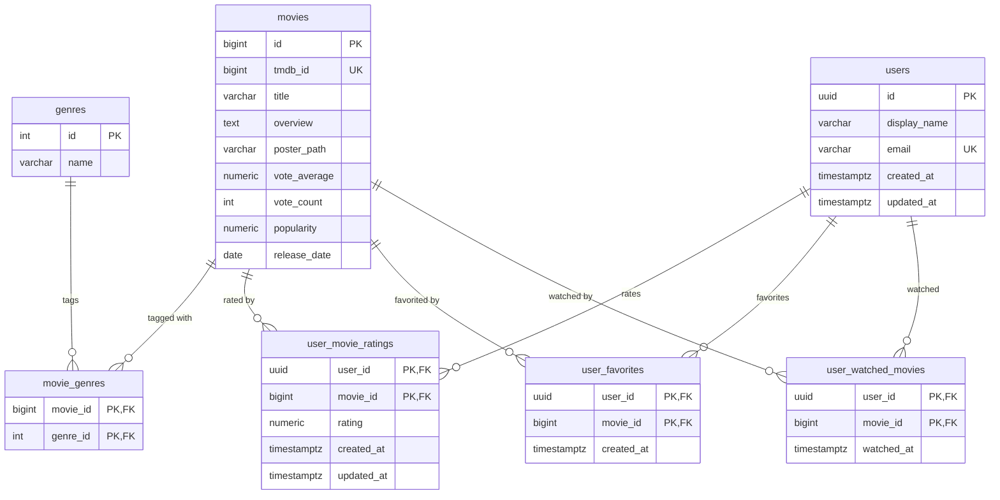

# ER & Class Diagrams

> **Academic project — temporary, non-commercial.** Not a production service and not affiliated with any movie studio, streaming provider, or TMDB. See the [README](../README.md) for the full disclaimer.

> These diagrams reflect the **implemented** system — the schema comes from the
> Flyway migrations (`backend/api/.../db/migration`) and the classes from the
> `:api` and `:engine` modules. The `.png` exports under `diagrams/` predate the
> implementation and are stale; the Mermaid blocks below are the source of truth.

---

## ER Diagram

The catalog tables (`genres`, `movies`, `movie_genres`) are populated once by the
seeder from the Kaggle dataset. The `users` row is provisioned from the JWT on
first authenticated request; the three preference tables are written by the app.

---

## Class Diagram

Layered `:api` (controllers → services → repositories) plus the Spring-free
`:engine` module, which the API reaches through the `MovieFeaturesProvider`
port. No live TMDB client — movie data is seeded offline.

```mermaid
classDiagram
    %% ── :api — controllers (thin HTTP) ──
    class MovieController
    class GenreController
    class RecommendationController
    class RatingController
    class FavoriteController
    class WatchedController
    class UserController

    %% ── :api — services ──
    class MovieService {
        +listPopular(page, size) PageDto~MovieSummaryDto~
        +listPopularByGenre(genreId, page, size) PageDto~MovieSummaryDto~
        +searchByTitle(query, page, size) PageDto~MovieSummaryDto~
        +getById(id) MovieSummaryDto
    }
    class GenreService {
        +listGenres() List~GenreDto~
    }
    class RecommendationService {
        +recommendFor(userId, limit) List~RecommendationDto~
        +similarTo(movieId, limit) List~RecommendationDto~
        +recommendFromSeeds(movieIds, limit) List~RecommendationDto~
    }
    class UserPreferenceService {
        +upsertRating(userId, movieId, rating)
        +addFavorite(userId, movieId)
        +markWatched(userId, movieId)
        +listRatingItems(userId) List~RatingItemDto~
        +listFavoriteItems(userId) List~FavoriteItemDto~
        +listWatchedItems(userId) List~WatchedItemDto~
    }
    class UserService {
        +getMe(jwt) UserMeDto
        +updateMe(jwt, request) UserMeDto
    }

    %% ── :api — persistence (Spring Data JPA) ──
    class MovieRepository
    class GenreRepository
    class UserRepository
    class UserMovieRatingRepository
    class UserFavoriteRepository
    class UserWatchedRepository

    %% ── :api — adapter (port implementation) ──
    class MovieFeaturesAdapter {
        +loadCatalog() List~MovieFeatures~
    }

    %% ── :engine — KNN recommender (no Spring) ──
    class MovieFeaturesProvider {
        <<interface>>
        +loadCatalog() List~MovieFeatures~
    }
    class ContentKnnRecommender {
        +recommend(seeds, limit, excluded) List~ScoredMovie~
        -cosineSimilarity(a, b) Double
    }
    class MovieFeatures {
        +Long movieId
        +Set~Int~ genreIds
        +Double voteAverage
        +Int voteCount
        +Double popularity
    }
    class WeightedMovie {
        +Long movieId
        +Double weight
    }
    class ScoredMovie {
        +Long movieId
        +Double score
    }

    MovieController --> MovieService
    GenreController --> GenreService
    RecommendationController --> RecommendationService
    RatingController --> UserPreferenceService
    FavoriteController --> UserPreferenceService
    WatchedController --> UserPreferenceService
    UserController --> UserService

    MovieService --> MovieRepository
    GenreService --> GenreRepository
    UserService --> UserRepository
    UserPreferenceService --> MovieRepository
    UserPreferenceService --> UserMovieRatingRepository
    UserPreferenceService --> UserFavoriteRepository
    UserPreferenceService --> UserWatchedRepository
    RecommendationService --> MovieRepository
    RecommendationService --> ContentKnnRecommender
    RecommendationService --> MovieFeaturesProvider

    MovieFeaturesAdapter ..|> MovieFeaturesProvider
    MovieFeaturesAdapter --> MovieRepository
    ContentKnnRecommender --> MovieFeatures
    ContentKnnRecommender --> WeightedMovie
    ContentKnnRecommender --> ScoredMovie
```

