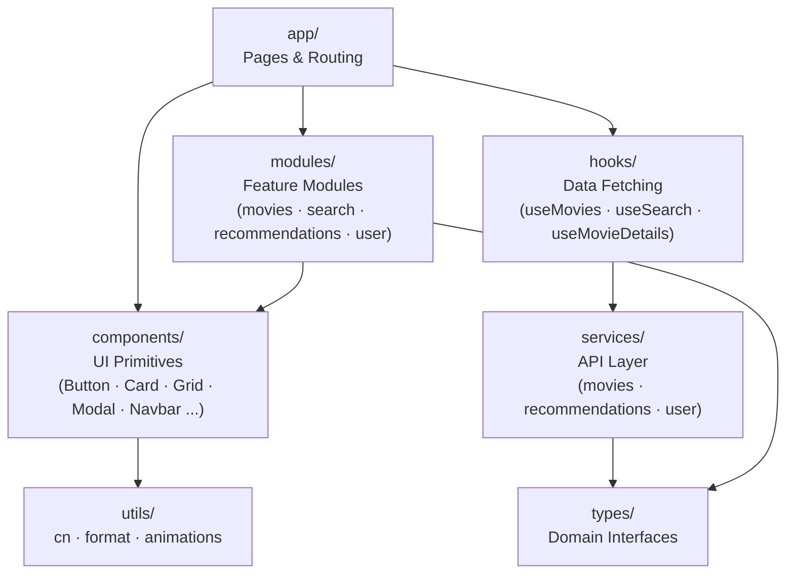
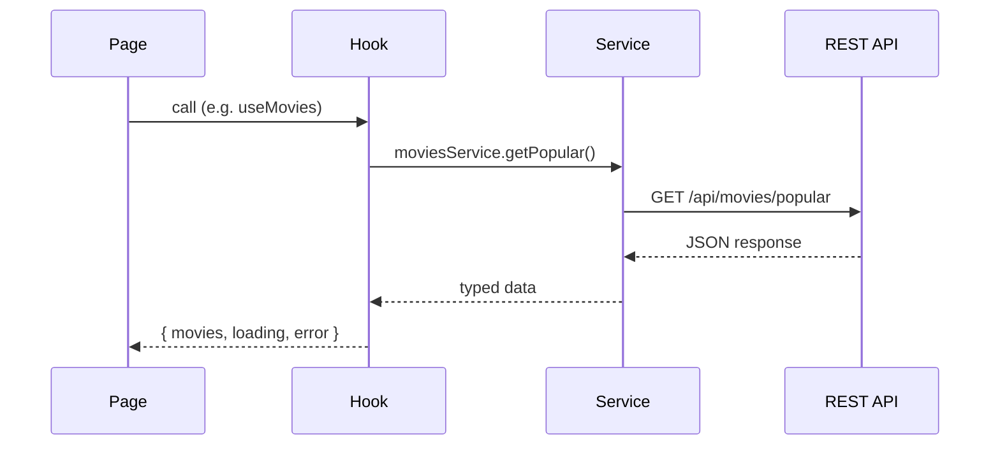

# Frontend Architecture

> **Academic project — temporary, non-commercial.** Not a production service and not affiliated with any movie studio, streaming provider, or TMDB. See the [README](../README.md) for the full disclaimer.

## Technology Stack

- Next.js (App Router)
- TypeScript
- TailwindCSS
- framer-motion (animations)

## Typography

- **Body font:** DM Sans — warm, rounded, comfortable for dark backgrounds
- **Mono font:** DM Mono — matched to DM Sans for code and labels
- Base `line-height: 1.65`, `letter-spacing: 0.01em` for comfortable body reading
- Headings use `letter-spacing: -0.02em` and `font-weight: 600`
- Never override the font stack inline — all font settings flow from `globals.css` and the CSS variables `--font-dm-sans` / `--font-dm-mono`

## Design Principles

The frontend must follow these principles:

- modular components
- reusable UI
- separation of concerns
- scalable architecture
- responsive design

## Component Hierarchy



## Data Flow



## Folder Structure

```
src/
app/        → Next.js pages and routing
components/ → reusable UI components
modules/    → feature-specific components
services/   → API communication
hooks/      → reusable hooks
types/      → TypeScript interfaces
utils/      → helper functions (cn, format, animations)
```

## UI Components

Examples of reusable components:

- Button
- Card
- Modal
- Navbar
- Input
- Grid / AnimatedGrid
- Pagination

## Feature Modules

```
modules/
  movies/             MovieCard
  search/             SearchBar
  recommendations/    RecommendationGrid
  user/               UserProfile
```

Each module should contain:

components
services
types
hooks

## API base URL

All HTTP calls flow through `services/api.ts`, which prepends a single base URL to every request. **The `/api` prefix lives in the base URL, not in the service paths.** Services therefore call `api.get("/movies/popular")`, never `api.get("/api/movies/popular")` — same convention as the Postman collection in `backend/postman/`.

The base URL is read from `NEXT_PUBLIC_API_URL`:

- **Development** — defaults to `http://localhost:8080/api` if the variable is missing.
- **Production** — the variable is required; `services/api.ts` throws at module load if it is not set.

Next.js env precedence (highest wins): `.env.local` > `.env.production` / `.env.development` > `.env`. Variables exposed to the browser **must** start with `NEXT_PUBLIC_` — without that prefix, Next.js strips them at build time.

Setup:

```bash
cp .env.local.example .env.local   # then edit if your backend is somewhere else
```

Toggle `NEXT_PUBLIC_USE_MOCKS=true` to bypass the network and return mock data from the services — useful while the backend is unavailable. Services import `USE_MOCKS` from `services/api.ts`; do not re-read `process.env.NEXT_PUBLIC_USE_MOCKS` inside individual files.

Set `NEXT_PUBLIC_SHOW_ACADEMIC_DISCLAIMER=false` to hide both the top-of-page banner (`AcademicDisclaimer`) and the matching line in the footer (`TmdbAttribution`). Defaults to shown; only the literal string `"false"` hides the disclaimer. TMDB attribution itself is unaffected — that one is required by TMDB's terms regardless.

## HTTP client

`services/api.ts` exposes `api.get / .post / .put / .patch / .del`. The transport is the native `fetch` — `axios` is intentionally **not** a dependency.

- **Why fetch:** zero new dependency, no recent supply-chain incidents to absorb, and the small set of features we actually use (timeout, abort, typed error) fits in ~50 lines on top of `fetch`. Revisit only if a concrete need appears that's awkward to express here.
- **Timeout:** every call accepts `timeoutMs` (default 15 000 ms). When the timeout fires, the request rejects with an `ApiHttpError` whose `code === "TIMEOUT"`.
- **Cancellation:** every call accepts a `signal: AbortSignal`. The internal `AbortController` is wired so an external abort cancels the request immediately — bridge an external signal in long-lived hooks (search debouncing, route change) to avoid races.
- **No retry / no interceptors:** intentional. Add a layer above (React Query, a higher-level service) when there's a real need; keeping the helper small avoids hidden behavior.

### Error contract

Every non-2xx response — and every network failure or timeout — throws `ApiHttpError` (`services/api-error.ts`). The class implements the `ApiError` interface (`types/api.ts`) so consumers can read:

```ts
try {
  await moviesService.getById(id);
} catch (err) {
  if (err instanceof ApiHttpError) {
    if (err.code === "RESOURCE_NOT_FOUND") { /* …show 404 UI… */ }
    if (err.code === "TIMEOUT")            { /* …show retry CTA… */ }
    err.details?.forEach(d => /* …field-level form errors… */);
  }
}
```

The `code` matches the backend's `ErrorEnum` value (see [backend `docs/error-handling.md`](../backend/docs/error-handling.md)) — `VALIDATION_FAILED`, `RESOURCE_NOT_FOUND`, etc. The client-side adds `TIMEOUT`, `NETWORK_ERROR`, and `UNKNOWN` for failures that never reach the backend.

`err.code` is typed as `string` rather than a TS literal union of every backend code. When a specific consumer needs exhaustive matching, declare a local union and narrow against it.

### Surfacing errors: inline vs toast

Errors split into two surfaces. Pick the one that matches the user impact, not the HTTP status.

| Surface | Use when | How |
|---|---|---|
| **`ErrorState`** (inline) | The failure blocks the primary content of the screen — list won't load, detail page can't render, profile is unreadable. | Render `<ErrorState title={…} message={…} />` in place of the content. |
| **`toast.error`** (sonner) | The failure is secondary — a side fetch failed but the main content still renders. Examples: similar-movies strip on the detail page, optimistic action failed but content stayed. | `import { toast } from "sonner"; toast.error(title, { description: message });` |

The `<Toaster />` is mounted once in `app/layout.tsx` (dark theme, bottom-right, `richColors`). Components only call `toast.*`; no provider plumbing.

### `resolveApiError` — friendly pt-BR copy

`utils/error-messages.ts` exposes `resolveApiError(err: ApiHttpError) → { title, message }`. It maps every known `code` to pt-BR copy and falls back to the backend's `err.message` (also pt-BR by contract) for codes it doesn't recognize.

```ts
const resolved = resolveApiError(err);
return <ErrorState title={resolved.title} message={resolved.message} />;
```

Never render `err.message` directly — always go through the resolver. This keeps the UI in pt-BR even when the failure originates client-side (network, timeout) where the backend never sent a message.

### Field-level validation

For 400 responses with `details[]`, `utils/error-fields.ts` exposes `toFieldErrors(err) → Record<string, string>` — a map of field name to message, ready to bind to form inputs. The first message wins when the backend sends multiple errors for the same field.

## Loading states

Every fetching surface uses a shared skeleton component, never an inline `animate-pulse` block. The pattern:

| Surface | Skeleton |
|---|---|
| Card grids (`/movies`, `/search`, similar strip) | `MovieGridSkeleton` (wraps `Grid` + N × `MovieCardSkeleton`) |
| Detail page (`/movies/[id]`) main card | `MovieDetailSkeleton` |
| Profile page (`/profile`) | `ProfileSkeleton` |
| Inline action (button submitting, `SearchBar` while debounced query is in flight) | Shared `Spinner` |

### Anti-flicker delay

Skeletons are gated by `useDelayedFlag(loading, 150)` from `hooks/useDelayedFlag.ts`. The hook returns `true` only after the source flag has stayed truthy for the delay window, and resets to `false` immediately when it drops. Cached/fast responses (< 150 ms) skip the skeleton entirely, avoiding a one-frame flash.

```tsx
const { movies, loading } = usePopularMovies(page);
const showSkeleton = useDelayedFlag(loading);
// ...
{loading && showSkeleton && <MovieGridSkeleton count={PAGE_SIZE} />}
```

### Independent fetches, independent skeletons

When a page coordinates multiple fetches, the hook exposes one loading flag per fetch so each section can render as soon as its data arrives. `useMovieDetails` returns both `loadingMovie` and `loadingSimilar` — the main card renders the moment the movie resolves, while the similar strip continues to show its own `MovieGridSkeleton` until the KNN call returns.

## URL state for listings

Listing pages (`/movies`, `/search`) keep their pagination — and where applicable, the search query — in the URL via `useSearchParams` + `router.push`. Reload, browser back/forward, and shared links all reproduce the exact view the user was looking at.

The convention is two query parameters:

| Param  | Meaning                          | Omitted when |
|--------|----------------------------------|--------------|
| `q`    | Search term (`/search` only)     | Empty/blank |
| `page` | 1-indexed page number            | `page === 1` |

Omitting defaults keeps the URL clean: `/search?q=matrix` instead of `/search?q=matrix&page=1`. The page component reads the URL, hands the values to the hook (`usePopularMovies` / `useSearch`), and translates UI events (search submit, pagination click) back into a `router.push` with a freshly-built query string. The hooks themselves never read or write the URL — they react to props.
