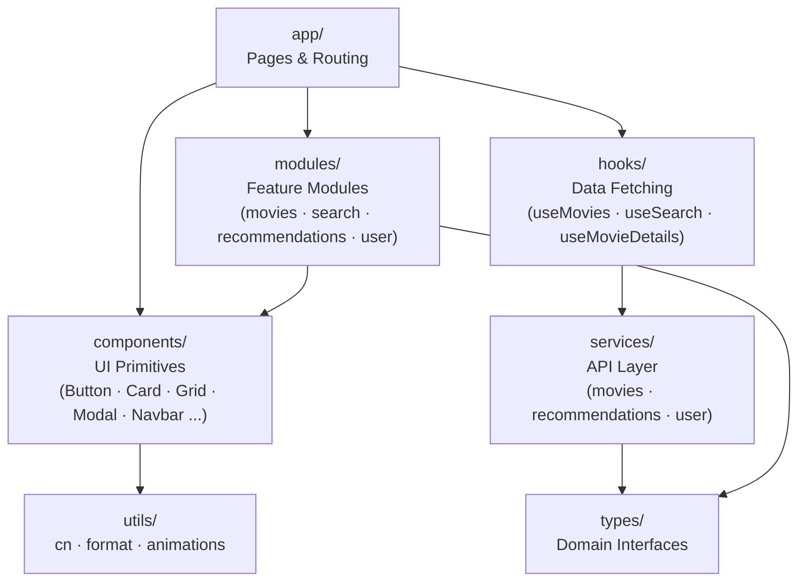
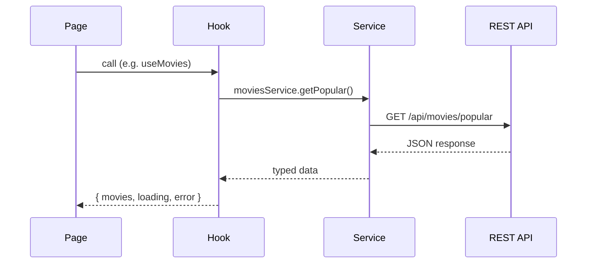

# Frontend Architecture

> **Academic project — temporary, non-commercial.** Not a production service and not affiliated with any movie studio, streaming provider, or TMDB. See the [README](../README.md) for the full disclaimer.

## Technology Stack

- Next.js (App Router)
- TypeScript
- TailwindCSS
- framer-motion (animations)

## Typography

- **Body font:** DM Sans — warm, rounded, comfortable for dark backgrounds
- **Mono font:** DM Mono — matched to DM Sans for code and labels
- Base `line-height: 1.65`, `letter-spacing: 0.01em` for comfortable body reading
- Headings use `letter-spacing: -0.02em` and `font-weight: 600`
- Never override the font stack inline — all font settings flow from `globals.css` and the CSS variables `--font-dm-sans` / `--font-dm-mono`

## Theming (light / dark)

The app ships a **light** and a **dark** theme, toggled by an icon button (`ThemeToggle`) in the navbar — visible on desktop and, on mobile, in the always-on cluster next to the menu button. Dark is the default for first-time visitors.

**Color model — inverting neutral ramp.** Instead of `dark:` variants on every utility, colors flow through a CSS-variable ramp `n-50 … n-950` defined in `globals.css` and mapped to Tailwind via `@theme inline`:

- In **dark** mode `n-X` equals Tailwind's `zinc-X` exactly, so the dark theme is pixel-identical to the original zinc-based design.
- In **light** mode the ramp is inverted (`n-100` is a dark ink, `n-900` a light surface), so a single set of classes yields a coherent light theme.

Practical rule: **use `n-*` neutrals (`bg-n-900`, `text-n-100`, `border-n-800`, …), never `zinc-*`.** A neutral utility automatically themes itself. The `amber-*` accent and `black/white` scrims are intentionally theme-agnostic.

**State & persistence.**

- `ThemeProvider` (wraps the tree in `layout.tsx`) exposes `useTheme(): { theme, toggleTheme, setTheme }`. The active theme is read from the `dark` class on `<html>` via `useSyncExternalStore`, so the DOM is the single source of truth and changes propagate across tabs.
- The choice persists in `localStorage` under `wtn-theme` (key exported as `THEME_STORAGE_KEY`).
- A small inline script in the `<head>` applies the stored theme class **before first paint** (no flash of the wrong theme); `<html>` carries `suppressHydrationWarning` because that script mutates the class. Keep the script's storage key in sync with `THEME_STORAGE_KEY`.
- `ThemedToaster` makes the Sonner toaster follow the active theme.

## Rating input (touch vs pointer)

The star rating control (`RatingStars`, on the movie detail page) adapts to the input device via `useMediaQuery("(pointer: coarse)")`:

- **Fine pointer (desktop):** hover preview where the cursor's horizontal half over a star selects `0.5` vs `1.0`; click commits the preview. Compact stars.
- **Coarse pointer (touch):** large tap targets (~48px), no hover preview — tapping star *n* commits a whole rating of *n* (1–5). Half-steps are a desktop-only affordance; existing `0.5` ratings still display correctly.

`useMediaQuery(query: string): boolean` (`hooks/useMediaQuery.ts`) is a reusable, SSR-safe media-query hook built on `matchMedia` + `useSyncExternalStore` (server snapshot is `false`, reconciled after hydration — no mismatch).

## Design Principles

The frontend must follow these principles:

- modular components
- reusable UI
- separation of concerns
- scalable architecture
- responsive design

## Component Hierarchy



## Data Flow



## Folder Structure

```
src/
app/        → Next.js pages and routing
components/ → reusable UI components
modules/    → feature-specific components
services/   → API communication
hooks/      → reusable hooks
types/      → TypeScript interfaces
utils/      → helper functions (cn, format, animations)
```

## UI Components

Examples of reusable components:

- Button
- Card
- Modal
- Navbar
- Input
- Select
- Grid / AnimatedGrid
- Pagination
- ThemeToggle (light/dark switch)

## Feature Modules

```
modules/
  movies/             MovieCard · FavoriteHeart · WatchedEye
                      FavoriteButton · WatchedButton · RatingStars
  search/             SearchBar · SearchDropdown
  recommendations/    RecommendationGrid · SuggestionsClient
                      QuickSuggestions · SeedPicker · GenreSuggestions
  user/               UserProfile · FavoritesList · WatchedList
                      RatingsList · ListStateView
  home/               HowItWorks · FeatureHighlights · HomeCta
  about/              AboutIntro · HowKnnWorks (KnnDiagram · KnnPipeline)
                      DataSource (DataImportFlow) · TechStack · AboutDisclaimer
```

Each module should contain:

components
services
types
hooks

## API base URL

All HTTP calls flow through `services/api.ts`, which prepends a single base URL to every request. **The `/api` prefix lives in the base URL, not in the service paths.** Services therefore call `api.get("/movies/popular")`, never `api.get("/api/movies/popular")` — same convention as the Postman collection in `backend/postman/`.

The base URL is read from `NEXT_PUBLIC_API_URL`:

- **Development** — defaults to `http://localhost:8080/api` if the variable is missing.
- **Production** — the variable is required; `services/api.ts` throws at module load if it is not set.

Next.js env precedence (highest wins): `.env.local` > `.env.production` / `.env.development` > `.env`. Variables exposed to the browser **must** start with `NEXT_PUBLIC_` — without that prefix, Next.js strips them at build time.

Setup:

```bash
cp .env.local.example .env.local   # then edit if your backend is somewhere else
```

Toggle `NEXT_PUBLIC_USE_MOCKS=true` to bypass the network and return mock data from the services — useful while the backend is unavailable. Services import `USE_MOCKS` from `services/api.ts`; do not re-read `process.env.NEXT_PUBLIC_USE_MOCKS` inside individual files.

Set `NEXT_PUBLIC_SHOW_ACADEMIC_DISCLAIMER=false` to hide both the top-of-page banner (`AcademicDisclaimer`) and the matching line in the footer (`TmdbAttribution`). Defaults to shown; only the literal string `"false"` hides the disclaimer. TMDB attribution itself is unaffected — that one is required by TMDB's terms regardless.

## Auth (BFF + opaque session)

The Next.js app is a **Backend-for-Frontend**: it runs the OAuth2 Authorization Code + PKCE dance server-side, holds tokens in a dedicated Redis (`auth-redis`, see [backend Keycloak section](./backend.md#keycloak-auth-provider)), and gives the browser only an **opaque 32-byte session id** in a single cookie. The browser never sees a JWT, never sees an access/refresh/id token, never sees PII via cookies. Even the Redis payload is **envelope-encrypted (AES-256-GCM)** before it touches disk.

### High-level diagram

```
              ┌────────────────┐
Browser <───> │ wtn_session    │  ← 32 bytes random, base64url, HttpOnly+Lax
              │ (only cookie)  │
              └────┬───────────┘
                   │
                   ▼
              ┌──────────────────────────────────────┐
   Next BFF   │ app/api/auth/*  + app/api/proxy/*    │
              │   - login / signup / callback        │
              │   - refresh / logout / me            │
              │   - proxy → upstream with Bearer     │
              └────┬───────────────────────┬─────────┘
       lookup ▼                            ▼ Bearer
   ┌──────────────────┐         ┌──────────────────────┐
   │ auth-redis       │         │ Spring Boot (8080)   │
   │ wtn:session:<id> │         │ JWT validated via    │
   │ AES-256-GCM      │         │ Keycloak JWKs        │
   │ {tokens, claims} │         └──────────────────────┘
   └──────────────────┘
```

### Cookies

| Cookie | Path | Lifetime | Content |
|--------|------|----------|---------|
| `wtn_session` | `/` | refresh-token lifespan (capped by `SESSION_MAX_LIFESPAN_SECONDS`) | Opaque 32-byte random id (base64url). Maps to a record in `auth-redis`. |
| `wtn_pkce_verifier` | `/api/auth/callback` | 10 min | Single-use PKCE verifier for the in-flight auth request. |
| `wtn_oauth_state` | `/api/auth/callback` | 10 min | CSRF token bound to the in-flight auth request. |

All cookies are `HttpOnly`, `SameSite=Lax`, and `Secure` when `AUTH_COOKIE_SECURE=true` (mandatory in any non-localhost deploy).

### Session record (Redis, encrypted)

`lib/auth/store.ts` writes the encrypted JSON of:

```
{
  sub, displayName, email, roles,           // identity (from id_token claims)
  accessToken, refreshToken, idToken,        // OIDC tokens
  accessExpiresAt, refreshExpiresAt,         // epoch seconds
  createdAt, lastAccessedAt
}
```

Key: `wtn:session:<sessionId>`. TTL: `min(refresh_expires_in, SESSION_MAX_LIFESPAN_SECONDS)`. Absolute cap: when `createdAt + SESSION_MAX_LIFESPAN_SECONDS < now`, the entry is destroyed regardless of refresh window.

Encryption: AES-256-GCM with a 32-byte key from `SESSION_ENCRYPTION_KEY`. Each entry has a per-record 12-byte nonce. A tampered or unkeyable entry decrypts to an exception → the entry is dropped and the user becomes anonymous.

### Routes

| Route | Verb | Purpose |
|-------|------|---------|
| `/api/auth/login` | GET | Generates verifier+state, sets temp cookies, 302 to Keycloak `/auth?prompt=login`. |
| `/api/auth/signup` | GET | Same as login but hits Keycloak `/registrations` (no `prompt`, no `kc_action`). |
| `/api/auth/callback` | GET | Validates state, exchanges `code + verifier` for tokens, verifies id_token via `jose` + JWKs, creates session in Redis, sets `wtn_session`. |
| `/api/auth/refresh` | POST | Refreshes tokens via `grant_type=refresh_token`, updates Redis record (cookie keeps the same id), renews maxAge. Auto-called by `/api/proxy/*` on a 401. |
| `/api/auth/logout` | POST/GET | Destroys Redis entry, clears cookie, 303 to Keycloak `end_session` with `id_token_hint`. |
| `/api/proxy/[...path]` | ALL | BFF proxy: reads session, attaches `Authorization: Bearer <access>`, forwards to `API_UPSTREAM_URL`. On 401 calls `/api/auth/refresh` once (deduped per process), then retries. |

There is **no** `/api/auth/me` endpoint. Identity is delivered to the client via the SSR'd `SessionProvider` context (see below), not over HTTP — the only place the browser sees identity is in the React tree, with no separate network round-trip.

### Frontend service layer

`services/api.ts` points at `/api/proxy` (same origin). The browser never knows the upstream URL — that's a server-only env var (`API_UPSTREAM_URL`). All existing services (`movies`, `recommendations`, `user`) call `api.get/post/...` unchanged.

### Server-only modules

Lives in `src/lib/auth/`. All files start with `import "server-only"` to make accidental client imports fail the build:

- `keycloak.ts` — issuer/auth/token/end-session URL builders from env.
- `pkce.ts` — `generateVerifier`, `deriveChallenge`, `generateState` via `node:crypto`.
- `cookies.ts` — cookie names + helpers (`setSessionCookie`, `clearTempAuthCookies`, etc.).
- `redis.ts` — `ioredis` client singleton with hot-reload safety.
- `crypto.ts` — `encryptPayload` / `decryptPayload` (AES-256-GCM).
- `store.ts` — `SessionStore` interface + `RedisSessionStore` implementation.
- `session.ts` — `readSession()` (identity for UI) and `readSessionRecord()` (full record incl. tokens, used only by the proxy/refresh routes).
- `guards.ts` — `requireSession(redirectTo)` and `redirectIfAuthenticated(target)`. Used by server components / layouts to enforce route policy via `redirect()` from `next/navigation`.
- `types.ts` — `Session` interface. **The only file in `lib/auth/` safe to import from a client component.**

### Route guards

Server-side guards live in `lib/auth/guards.ts`. Two helpers cover the entire product surface today:

- `requireSession()` — used by `app/profile/page.tsx`. Anonymous users get redirected to `/login` before render.
- `redirectIfAuthenticated()` — used by `app/(auth)/layout.tsx`, which wraps `/login` and `/signup` under a Next.js route group. Already-authenticated users are bounced to `/` so they can't kick off a duplicate auth flow.

The route group `(auth)/` is transparent to URLs (`/login` and `/signup` paths stay the same); the layout is what carries the guard. Public pages (`/`, `/about`, `/movies/*`, `/search`) need no guard. The authenticated pages — `/profile`, `/favorites`, `/watched`, `/ratings`, `/suggestions` — are server components that call `requireSession()` before rendering their client child.

### Preference providers (favorites & watched)

`app/layout.tsx` mounts two client contexts so movie cards can show toggle state without a request per card:

- `FavoritesProvider` (`useFavorites()`) — loads the caller's favorite ids once via `GET /favorites`; backs `FavoriteHeart` and `FavoriteButton`.
- `WatchedProvider` (`useWatched()`) — loads the caller's watched ids once via `GET /watched`; backs `WatchedEye` (card overlay, next to the heart) and `WatchedButton` (detail page).

Both expose `is…/toggle…/ready`, do optimistic updates with rollback + a pt-BR toast on failure, and fetch nothing for anonymous visitors. The `/favorites`, `/watched`, `/ratings` list pages instead fetch *enriched* rows (`…ItemDto`) through `useAsyncList` + the shared `ListStateView`.

### Session in the client (no /api/auth/me)

The root `app/layout.tsx` is an async server component that calls `readSession()` once per SSR and injects the result into `<SessionProvider initialSession={session}>` (a client context). Any client component reads `useSession(): Session | null` from `@/components/SessionProvider` — `Navbar`, `MobileMenu`, etc. all consume identity that way.

There is **no HTTP endpoint** publishing identity: the previous `/api/auth/me` route was removed in favor of this SSR-embedded path. Benefits:

- No network round-trip for identity → no flicker between "Entrar/Criar conta" and the user's name on first paint.
- No public surface advertising session state to scrapers / probes / extensions.
- Logout/login both re-run the layout SSR on the next navigation → context reflects the new state without extra fetches.

### Env vars

#### Client-side (`NEXT_PUBLIC_*`)
| Variable | Purpose |
|----------|---------|
| `NEXT_PUBLIC_KEYCLOAK_BASE_URL`   | Keycloak issuer base (e.g. `http://localhost:8180`). Used server-side too. |
| `NEXT_PUBLIC_KEYCLOAK_REALM`      | Realm name. |
| `NEXT_PUBLIC_KEYCLOAK_CLIENT_ID`  | Public SPA client id. |
| `NEXT_PUBLIC_AUTH_REDIRECT_URI`   | App origin, e.g. `http://localhost:3000`. `/api/auth/callback` is appended internally. |

#### Server-only
| Variable | Purpose |
|----------|---------|
| `API_UPSTREAM_URL`              | Upstream Spring Boot base (e.g. `http://localhost:8080/api`). The BFF proxy reads this. |
| `KEYCLOAK_JWKS_URL`             | JWKs endpoint used by `jose.jwtVerify` for the id_token at callback. |
| `AUTH_REDIS_URL`                | Connection string for the session store (e.g. `redis://:changeme@localhost:6380`). |
| `AUTH_COOKIE_SECURE`            | `"true"` → cookies get the `Secure` flag. Required for HTTPS deploys. |
| `SESSION_MAX_LIFESPAN_SECONDS`  | Absolute upper bound on a session (default `36000` = 10 h). |
| `SESSION_ENCRYPTION_KEY`        | 32 bytes base64. **Required.** Generate via `node -e "console.log(require('crypto').randomBytes(32).toString('base64'))"`. |

### Security headers

`next.config.ts` exports `async headers()` returning the same set on every response:

| Header | Value |
|--------|-------|
| `Strict-Transport-Security` | `max-age=31536000; includeSubDomains` |
| `X-Frame-Options` | `DENY` |
| `X-Content-Type-Options` | `nosniff` |
| `Referrer-Policy` | `no-referrer` |
| `Permissions-Policy` | `camera=(), microphone=(), geolocation=(), interest-cohort=()` |
| `Content-Security-Policy` | `default-src 'self'; script-src 'self' 'unsafe-inline'; style-src 'self' 'unsafe-inline'; img-src 'self' https://image.tmdb.org data:; font-src 'self' https://fonts.gstatic.com; connect-src 'self'; form-action 'self' http://localhost:8180; frame-ancestors 'none'; base-uri 'self'; object-src 'none'` |

CSP `connect-src 'self'` is enough because the BFF proxy fans out to upstream server-side; the browser only ever fetches `/api/proxy/*`, never the upstream directly. `form-action` allows the redirect to Keycloak's hosted forms.

### Tests to validate token isolation

Run these after `npm run build` to confirm the BFF doesn't leak anything client-side:

- `grep -rE "wtn_access|wtn_refresh|wtn_id_token|wtn_session|jwtVerify" .next/static/` → empty.
- `grep -rl "jose" .next/static/` → empty.
- `grep -rl "ioredis" .next/static/` → empty.
- `grep -rE 'from "@/lib/auth/' src/ --include="*.tsx" --include="*.ts" | grep -v "/types"` → only files in `src/app/api/**/route.ts` and `src/app/profile/page.tsx` (server components).
- In a logged-in browser session, `document.cookie` returns `""` (HttpOnly).
- `curl -s -H "Cookie: $COOKIE" http://localhost:3000/ | grep -cE "eyJ[A-Za-z0-9_-]{20,}"` → `0` for every page (no JWT in SSR HTML).

## HTTP client

`services/api.ts` exposes `api.get / .post / .put / .patch / .del`. The transport is the native `fetch` — `axios` is intentionally **not** a dependency.

- **Why fetch:** zero new dependency, no recent supply-chain incidents to absorb, and the small set of features we actually use (timeout, abort, typed error) fits in ~50 lines on top of `fetch`. Revisit only if a concrete need appears that's awkward to express here.
- **Timeout:** every call accepts `timeoutMs` (default 15 000 ms). When the timeout fires, the request rejects with an `ApiHttpError` whose `code === "TIMEOUT"`.
- **Cancellation:** every call accepts a `signal: AbortSignal`. The internal `AbortController` is wired so an external abort cancels the request immediately — bridge an external signal in long-lived hooks (search debouncing, route change) to avoid races.
- **No retry / no interceptors:** intentional. Add a layer above (React Query, a higher-level service) when there's a real need; keeping the helper small avoids hidden behavior.

### Error contract

Every non-2xx response — and every network failure or timeout — throws `ApiHttpError` (`services/api-error.ts`). The class implements the `ApiError` interface (`types/api.ts`) so consumers can read:

```ts
try {
  await moviesService.getById(id);
} catch (err) {
  if (err instanceof ApiHttpError) {
    if (err.code === "RESOURCE_NOT_FOUND") { /* …show 404 UI… */ }
    if (err.code === "TIMEOUT")            { /* …show retry CTA… */ }
    err.details?.forEach(d => /* …field-level form errors… */);
  }
}
```

The `code` matches the backend's `ErrorEnum` value (see [backend `docs/error-handling.md`](../backend/docs/error-handling.md)) — `VALIDATION_FAILED`, `RESOURCE_NOT_FOUND`, etc. The client-side adds `TIMEOUT`, `NETWORK_ERROR`, and `UNKNOWN` for failures that never reach the backend.

`err.code` is typed as `string` rather than a TS literal union of every backend code. When a specific consumer needs exhaustive matching, declare a local union and narrow against it.

### Surfacing errors: inline vs toast

Errors split into two surfaces. Pick the one that matches the user impact, not the HTTP status.

| Surface | Use when | How |
|---|---|---|
| **`ErrorState`** (inline) | The failure blocks the primary content of the screen — list won't load, detail page can't render, profile is unreadable. | Render `<ErrorState title={…} message={…} />` in place of the content. |
| **`toast.error`** (sonner) | The failure is secondary — a side fetch failed but the main content still renders. Examples: similar-movies strip on the detail page, optimistic action failed but content stayed. | `import { toast } from "sonner"; toast.error(title, { description: message });` |

The `<Toaster />` is mounted once in `app/layout.tsx` (dark theme, bottom-right, `richColors`). Components only call `toast.*`; no provider plumbing.

### `resolveApiError` — friendly pt-BR copy

`utils/error-messages.ts` exposes `resolveApiError(err: ApiHttpError) → { title, message }`. It maps every known `code` to pt-BR copy and falls back to the backend's `err.message` (also pt-BR by contract) for codes it doesn't recognize.

```ts
const resolved = resolveApiError(err);
return <ErrorState title={resolved.title} message={resolved.message} />;
```

Never render `err.message` directly — always go through the resolver. This keeps the UI in pt-BR even when the failure originates client-side (network, timeout) where the backend never sent a message.

### Field-level validation

For 400 responses with `details[]`, `utils/error-fields.ts` exposes `toFieldErrors(err) → Record<string, string>` — a map of field name to message, ready to bind to form inputs. The first message wins when the backend sends multiple errors for the same field.

## Loading states

Every fetching surface uses a shared skeleton component, never an inline `animate-pulse` block. The pattern:

| Surface | Skeleton |
|---|---|
| Card grids (`/movies`, `/search`, similar strip) | `MovieGridSkeleton` (wraps `Grid` + N × `MovieCardSkeleton`) |
| Detail page (`/movies/[id]`) main card | `MovieDetailSkeleton` |
| Profile page (`/profile`) | `ProfileSkeleton` |
| Inline action (button submitting, `SearchBar` while debounced query is in flight) | Shared `Spinner` |

### Anti-flicker delay

Skeletons are gated by `useDelayedFlag(loading, 150)` from `hooks/useDelayedFlag.ts`. The hook returns `true` only after the source flag has stayed truthy for the delay window, and resets to `false` immediately when it drops. Cached/fast responses (< 150 ms) skip the skeleton entirely, avoiding a one-frame flash.

```tsx
const { movies, loading } = usePopularMovies(page);
const showSkeleton = useDelayedFlag(loading);
// ...
{loading && showSkeleton && <MovieGridSkeleton count={PAGE_SIZE} />}
```

### Independent fetches, independent skeletons

When a page coordinates multiple fetches, the hook exposes one loading flag per fetch so each section can render as soon as its data arrives. `useMovieDetails` returns both `loadingMovie` and `loadingSimilar` — the main card renders the moment the movie resolves, while the similar strip continues to show its own `MovieGridSkeleton` until the KNN call returns.

## URL state for listings

Listing pages (`/movies`, `/search`) keep their pagination — and where applicable, the search query — in the URL via `useSearchParams` + `router.push`. Reload, browser back/forward, and shared links all reproduce the exact view the user was looking at.

The convention is two query parameters:

| Param  | Meaning                          | Omitted when |
|--------|----------------------------------|--------------|
| `q`    | Search term (`/search` only)     | Empty/blank |
| `page` | 1-indexed page number            | `page === 1` |
| `sort` | Catalog ordering (`/movies` only) — `RELEVANCE`/`POPULARITY`/`RATING`/`RELEASE` | `sort === RELEVANCE` |

Changing the catalog `sort` resets `page` to 1, since the page index no longer points at the same slice. Both listings are bounded, with deliberately different windows: the `/movies` catalog explorer is a curated top-200 / 10-page browse (`CATALOG_MAX_MOVIES`), while `/search` allows free, in-depth exploration up to 1000 results / 50 pages (`SEARCH_MAX_RESULTS`). From the catalog, going past the window is funnelled to `/search`.

## Search: autocomplete & history

`SearchBar` is a combobox. Below the input it opens `SearchDropdown`, which shows
one of two things:

- **Empty input** → recent searches, from `useSearchHistory`.
- **Typing** → autocomplete suggestions, from `useSuggestions` (debounced
  `/movies/suggest` call, 2-char minimum).

Arrow keys move the highlight, `Enter` picks the highlighted row, `Esc` closes.
Picking a suggestion **fills the query and runs the full search** (it does not
deep-link to the movie). Every committed query — typed, submitted, or picked —
is recorded in history.

**History is session-only.** `useSearchHistory` persists to `sessionStorage`
(`wtn:search-history`, last 8 unique queries): it survives reloads and in-tab
navigation, is wiped when the tab closes, and is **never sent to the server or
tied to a user account** — deliberately not `localStorage` and not user-persisted.
Loaded after mount to avoid an SSR hydration mismatch.

Omitting defaults keeps the URL clean: `/search?q=matrix` instead of `/search?q=matrix&page=1`. The page component reads the URL, hands the values to the hook (`usePopularMovies` / `useSearch`), and translates UI events (search submit, pagination click) back into a `router.push` with a freshly-built query string. The hooks themselves never read or write the URL — they react to props.
