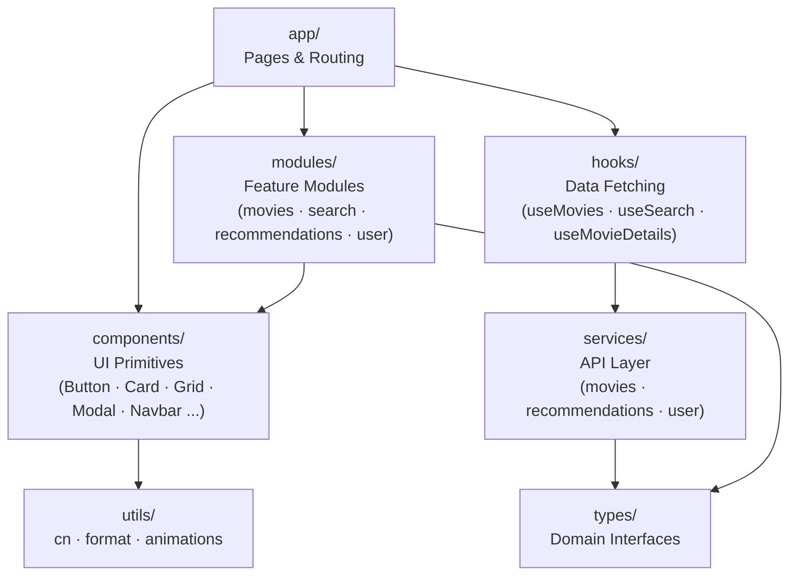
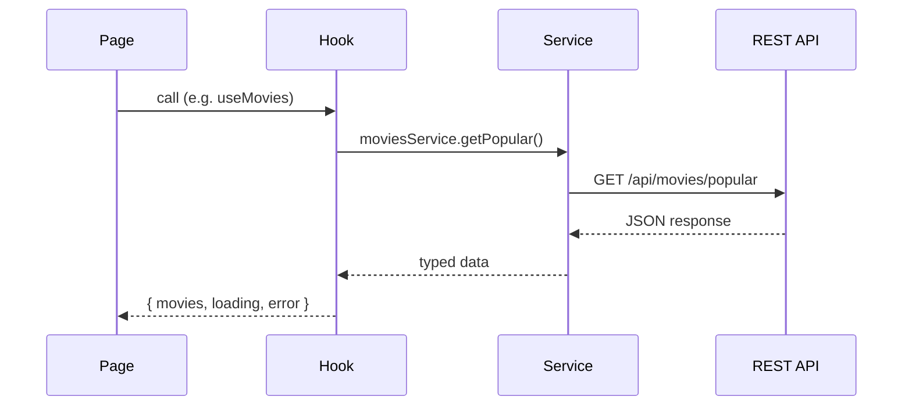

# Frontend Architecture

> **Academic project — temporary, non-commercial.** Not a production service and not affiliated with any movie studio, streaming provider, or TMDB. See the [README](../README.md) for the full disclaimer.

## Technology Stack

- Next.js (App Router)
- TypeScript
- TailwindCSS
- framer-motion (animations)

## Typography

- **Body font:** DM Sans — warm, rounded, comfortable for dark backgrounds
- **Mono font:** DM Mono — matched to DM Sans for code and labels
- Base `line-height: 1.65`, `letter-spacing: 0.01em` for comfortable body reading
- Headings use `letter-spacing: -0.02em` and `font-weight: 600`
- Never override the font stack inline — all font settings flow from `globals.css` and the CSS variables `--font-dm-sans` / `--font-dm-mono`

## Design Principles

The frontend must follow these principles:

- modular components
- reusable UI
- separation of concerns
- scalable architecture
- responsive design

## Component Hierarchy



## Data Flow



## Folder Structure

```
src/
app/        → Next.js pages and routing
components/ → reusable UI components
modules/    → feature-specific components
services/   → API communication
hooks/      → reusable hooks
types/      → TypeScript interfaces
utils/      → helper functions (cn, format, animations)
```

## UI Components

Examples of reusable components:

- Button
- Card
- Modal
- Navbar
- Input
- Grid / AnimatedGrid
- Pagination

## Feature Modules

```
modules/
  movies/             MovieCard
  search/             SearchBar
  recommendations/    RecommendationGrid
  user/               UserProfile
```

Each module should contain:

components
services
types
hooks

## API base URL

All HTTP calls flow through `services/api.ts`, which prepends a single base URL to every request. **The `/api` prefix lives in the base URL, not in the service paths.** Services therefore call `api.get("/movies/popular")`, never `api.get("/api/movies/popular")` — same convention as the Postman collection in `backend/postman/`.

The base URL is read from `NEXT_PUBLIC_API_URL`:

- **Development** — defaults to `http://localhost:8080/api` if the variable is missing.
- **Production** — the variable is required; `services/api.ts` throws at module load if it is not set.

Next.js env precedence (highest wins): `.env.local` > `.env.production` / `.env.development` > `.env`. Variables exposed to the browser **must** start with `NEXT_PUBLIC_` — without that prefix, Next.js strips them at build time.

Setup:

```bash
cp .env.local.example .env.local   # then edit if your backend is somewhere else
```

Toggle `NEXT_PUBLIC_USE_MOCKS=true` to bypass the network and return mock data from the services — useful while the backend is unavailable. Services import `USE_MOCKS` from `services/api.ts`; do not re-read `process.env.NEXT_PUBLIC_USE_MOCKS` inside individual files.

## HTTP client

`services/api.ts` exposes `api.get / .post / .put / .patch / .del`. The transport is the native `fetch` — `axios` is intentionally **not** a dependency.

- **Why fetch:** zero new dependency, no recent supply-chain incidents to absorb, and the small set of features we actually use (timeout, abort, typed error) fits in ~50 lines on top of `fetch`. Revisit only if a concrete need appears that's awkward to express here.
- **Timeout:** every call accepts `timeoutMs` (default 15 000 ms). When the timeout fires, the request rejects with an `ApiHttpError` whose `code === "TIMEOUT"`.
- **Cancellation:** every call accepts a `signal: AbortSignal`. The internal `AbortController` is wired so an external abort cancels the request immediately — bridge an external signal in long-lived hooks (search debouncing, route change) to avoid races.
- **No retry / no interceptors:** intentional. Add a layer above (React Query, a higher-level service) when there's a real need; keeping the helper small avoids hidden behavior.

### Error contract

Every non-2xx response — and every network failure or timeout — throws `ApiHttpError` (`services/api-error.ts`). The class implements the `ApiError` interface (`types/api.ts`) so consumers can read:

```ts
try {
  await moviesService.getById(id);
} catch (err) {
  if (err instanceof ApiHttpError) {
    if (err.code === "RESOURCE_NOT_FOUND") { /* …show 404 UI… */ }
    if (err.code === "TIMEOUT")            { /* …show retry CTA… */ }
    err.details?.forEach(d => /* …field-level form errors… */);
  }
}
```

The `code` matches the backend's `ErrorEnum` value (see [backend `docs/error-handling.md`](../backend/docs/error-handling.md)) — `VALIDATION_FAILED`, `RESOURCE_NOT_FOUND`, etc. The client-side adds `TIMEOUT`, `NETWORK_ERROR`, and `UNKNOWN` for failures that never reach the backend.

`err.code` is typed as `string` rather than a TS literal union of every backend code. When a specific consumer needs exhaustive matching, declare a local union and narrow against it.
