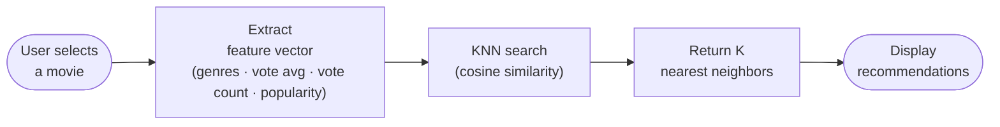
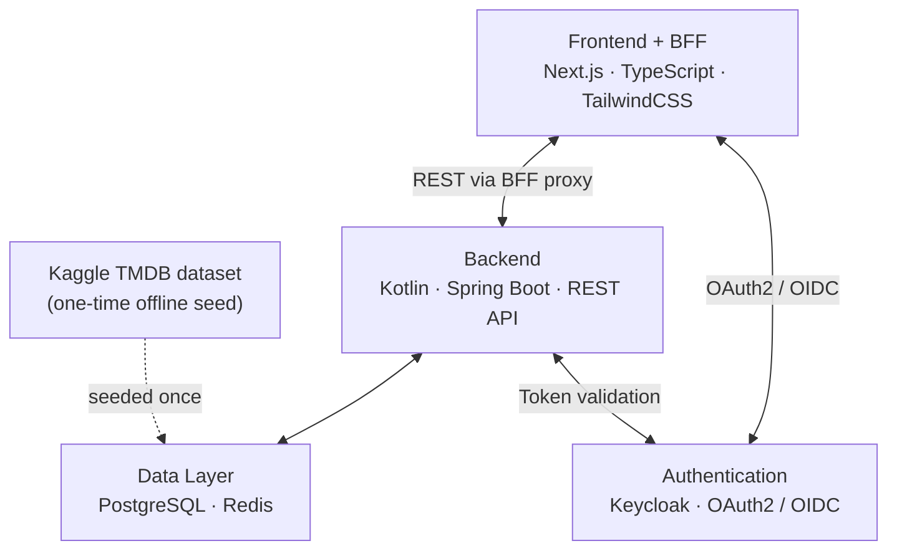

# WatchToNext – Project Overview

> **Academic project — temporary, non-commercial.** Not a production service and not affiliated with any movie studio, streaming provider, or TMDB. See the [README](../README.md) for the full disclaimer.

## Project Description

WatchToNext is a movie recommendation platform designed to help users discover new movies based on similarity analysis.

The system uses the K-Nearest Neighbors (KNN) algorithm to recommend movies that are similar to others previously selected or viewed by the user.

Movie metadata (titles, overviews, genres, ratings, poster paths) comes from the Full TMDB Movies Dataset on Kaggle, imported once into the database by the seeder. The backend makes no live external API calls after that; the only runtime external fetch is the browser loading poster images from TMDB's image CDN.

The main objective of the platform is to provide more relevant movie suggestions compared to generic ranking-based recommendation systems.

## Core Features

- Public catalog browsing and title search
- Movie details visualization
- Similar-movie recommendations (KNN)
- Favorites, ratings, and watched history — each with its own list page
- Authenticated suggestions page — quick (full history), seed-picked movies, or by genre
- User profile with list summaries
- Keycloak-backed sign-up / login

## Recommendation Flow

## System Architecture

The system follows a distributed architecture composed of:

