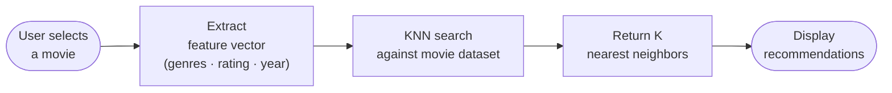
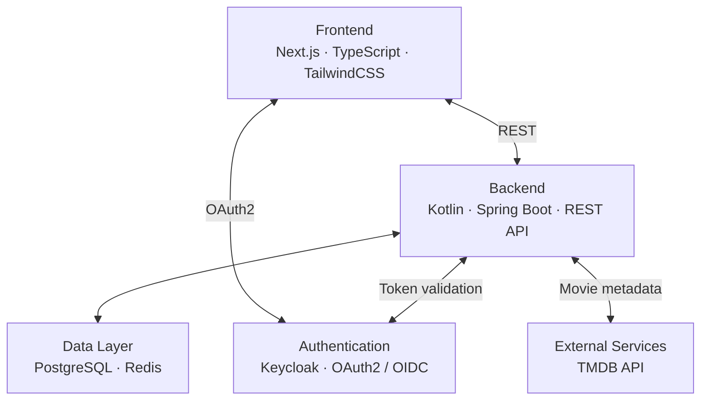

# WatchToNext – Project Overview

> **Academic project — temporary, non-commercial.** Not a production service and not affiliated with any movie studio, streaming provider, or TMDB. See the [README](../README.md) for the full disclaimer.

## Project Description

WatchToNext is a movie recommendation platform designed to help users discover new movies based on similarity analysis.

The system uses the K-Nearest Neighbors (KNN) algorithm to recommend movies that are similar to others previously selected or viewed by the user.

The platform integrates with the TMDB (The Movie Database) API to retrieve detailed information about movies, including metadata such as genres, ratings, cast, and descriptions.

The main objective of the platform is to provide more relevant movie suggestions compared to generic ranking-based recommendation systems.

## Core Features

- Movie search
- Movie details visualization
- Similar movie recommendations
- Genre browsing
- User profile
- Personalized recommendations
- Movie discovery interface

## Recommendation Flow

## System Architecture

The system follows a distributed architecture composed of:

