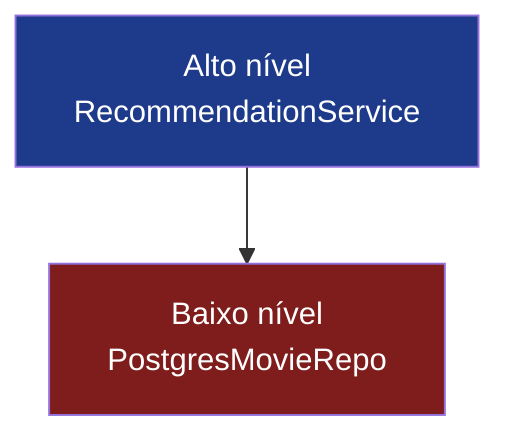
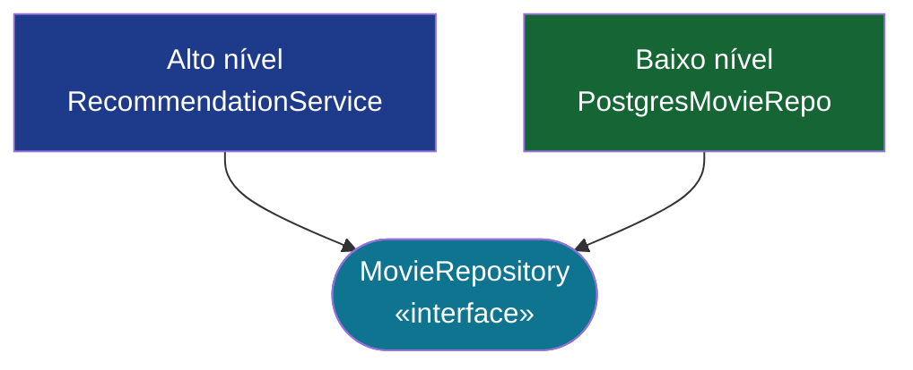
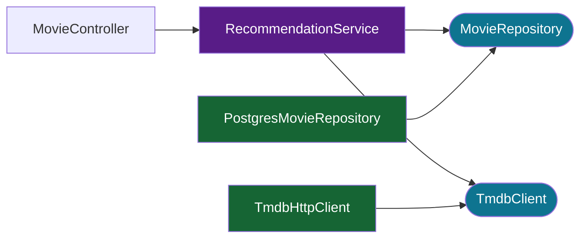

# Princípio da Inversão de Dependência

O "D" de **SOLID**

<div class="abs-br m-6 text-sm opacity-70">
  Engenharia de Software e Princípios · 2026
</div>

---
layout: intro
---

# Apresentação do Grupo

<div class="grid grid-cols-2 gap-6 pt-8">

<div class="border border-gray-500 border-opacity-30 rounded-lg p-6">
  <carbon:user-avatar class="text-3xl mb-2 text-cyan-400"/>
  <h3>Pedro Santos</h3>
  <p class="opacity-70 text-sm">Backend & Arquitetura</p>
</div>

<div class="border border-gray-500 border-opacity-30 rounded-lg p-6">
  <carbon:user-avatar class="text-3xl mb-2 text-cyan-400"/>
  <h3>Integrante 2</h3>
  <p class="opacity-70 text-sm">Função / Tópico</p>
</div>

<div class="border border-gray-500 border-opacity-30 rounded-lg p-6">
  <carbon:user-avatar class="text-3xl mb-2 text-cyan-400"/>
  <h3>Integrante 3</h3>
  <p class="opacity-70 text-sm">Função / Tópico</p>
</div>

<div class="border border-gray-500 border-opacity-30 rounded-lg p-6">
  <carbon:user-avatar class="text-3xl mb-2 text-cyan-400"/>
  <h3>Integrante 4</h3>
  <p class="opacity-70 text-sm">Função / Tópico</p>
</div>

</div>

<div class="pt-8 text-sm opacity-60">
  <strong>Projeto:</strong> watchToNext — plataforma de recomendação de filmes baseada em KNN
</div>

---
layout: section
---

# 01

## O Princípio

<div class="text-sm opacity-70 pt-4">Que problema ele resolve?</div>

---
layout: default
---

# De onde ele vem?

<div class="grid grid-cols-2 gap-8 pt-4">

<div>

**SOLID** — cinco princípios de design orientado a objetos formulados por **Robert C. Martin** (Uncle Bob) no início dos anos 2000.

<v-clicks>

- **S** — Responsabilidade Única
- **O** — Aberto / Fechado
- **L** — Substituição de Liskov
- **I** — Segregação de Interface
- <span class="text-cyan-400 font-bold">D — **Inversão de Dependência**</span>

</v-clicks>

</div>

<div v-click class="border-l-4 border-cyan-400 pl-4 italic opacity-90 self-center">

  "Módulos de alto nível não devem depender de módulos de baixo nível.
  Ambos devem depender de abstrações."

  <div class="text-xs opacity-60 not-italic mt-3">— Robert C. Martin, 1996</div>
</div>

</div>

---
layout: default
---

# A intuição

<div class="pt-6 grid grid-cols-2 gap-10">

<div>

### Sem DIP

A lógica de negócio fica **colada** a um banco específico, a um cliente de API específico, a um framework específico.

Trocar o banco? Reescrever o serviço.
Mockar para testes? Sofrido.

<div class="mt-6 p-4 bg-red-500 bg-opacity-10 border border-red-400 border-opacity-40 rounded">
  <carbon:warning class="inline text-red-400"/> Acoplamento forte = sistemas frágeis
</div>

</div>

<div>

### Com DIP

A lógica de negócio depende **do que** algo faz, não **de como** faz.

Trocar implementações é fácil. Testar isoladamente também. Evoluir sem medo.

<div class="mt-6 p-4 bg-green-500 bg-opacity-10 border border-green-400 border-opacity-40 rounded">
  <carbon:checkmark class="inline text-green-400"/> Acoplamento fraco = sistemas flexíveis
</div>

</div>

</div>

---
layout: section
---

# 02

## Definição Técnica

---

# Duas regras formais

<div class="pt-2 space-y-4">

<div v-click class="p-4 border-l-4 border-cyan-400 bg-gray-500 bg-opacity-5">
  <div class="text-cyan-400 font-mono text-xs mb-1">REGRA 1</div>
  <div>
    Módulos de alto nível <strong>não</strong> devem depender de módulos de baixo nível.
    Ambos devem depender de <strong>abstrações</strong>.
  </div>
</div>

<div v-click class="p-4 border-l-4 border-purple-400 bg-gray-500 bg-opacity-5">
  <div class="text-purple-400 font-mono text-xs mb-1">REGRA 2</div>
  <div>
    Abstrações <strong>não</strong> devem depender de detalhes.
    Detalhes devem depender de <strong>abstrações</strong>.
  </div>
</div>

<div v-click class="text-sm opacity-70">
  Em Kotlin / Java, "abstração" geralmente significa uma <code>interface</code> ou uma <code>classe abstrata</code>.
</div>

</div>

---

# Invertendo a dependência

A seta de dependência é **invertida** — daí o nome *inversão*.

<div class="grid grid-cols-2 gap-6 pt-6">

<div>

### Fluxo tradicional



<div class="text-xs opacity-70 mt-2">
  O serviço conhece o Postgres. Trocar o Postgres = reescrever o serviço.
</div>

</div>

<div>

### Fluxo invertido



<div class="text-xs opacity-70 mt-2">
  Os dois lados dependem da abstração. O serviço nem sabe que existe Postgres.
</div>

</div>

</div>

---

# DIP vs. Injeção de Dependência

<div class="pt-4 grid grid-cols-2 gap-8">

<div>

### **Inversão** de Dependência

Um *princípio de design*.
Trata da **direção** das setas de dependência na arquitetura.

</div>

<div>

### **Injeção** de Dependência

Uma *técnica*.
Uma forma de **fornecer** dependências (construtor, setter, framework).

</div>

</div>

<div v-click class="pt-8 p-5 bg-cyan-500 bg-opacity-10 border border-cyan-400 border-opacity-40 rounded text-center">
  Injeção é uma <strong>forma comum</strong> de aplicar Inversão — mas dá pra ter injeção sem inversão, e inversão sem injeção.
</div>

<div v-click class="text-sm opacity-70 pt-4">
  O <code>@Autowired</code> / injeção via construtor do Spring é DI. Projetar o serviço para receber uma <em>interface</em> <code>MovieRepository</code> é DIP.
</div>

---
layout: section
---

# 03

## Exemplos de Código

---

# ❌ Violando o DIP

<div class="text-sm opacity-70 mb-2">Serviço de alto nível instanciando diretamente uma classe concreta.</div>

```kotlin {all|2-3|6-9|all}
class RecommendationService {
    // Acoplamento forte: o serviço conhece a implementação exata do banco
    private val repo = PostgresMovieRepository()

    fun recommendFor(userId: Long): List<Movie> {
        val watched = repo.findWatchedByUser(userId)
        // ... lógica do KNN ...
        return repo.findSimilar(watched)
    }
}

class PostgresMovieRepository {
    fun findWatchedByUser(userId: Long): List<Movie> { /* JDBC */ }
    fun findSimilar(seed: List<Movie>): List<Movie> { /* JDBC */ }
}
```

<v-click>

<div class="pt-2 text-sm">
  <carbon:warning class="inline text-red-400"/>
  Não dá pra testar sem um Postgres real. Não dá pra trocar por Redis, Mongo ou um fake em memória.
</div>

</v-click>

---

# ✅ Aplicando o DIP

<div class="text-sm opacity-70 mb-2">Dependa de uma abstração e injete a implementação.</div>

```kotlin {all|1-4|7|10-13|all}
interface MovieRepository {
    fun findWatchedByUser(userId: Long): List<Movie>
    fun findSimilar(seed: List<Movie>): List<Movie>
}

@Service
class RecommendationService(private val repo: MovieRepository) {
    fun recommendFor(userId: Long): List<Movie> {
        val watched = repo.findWatchedByUser(userId)
        return repo.findSimilar(watched)
    }
}

@Repository
class PostgresMovieRepository : MovieRepository { /* JDBC */ }
```

<v-click>

<div class="pt-2 text-sm">
  <carbon:checkmark class="inline text-green-400"/>
  O serviço fica testável com um fake. O Postgres pode ser trocado por Redis, Mongo ou qualquer outra coisa.
</div>

</v-click>

---

# A mesma ideia em Java

```java {all|1-4|6-13|all}
public interface MovieRepository {
    List<Movie> findWatchedByUser(Long userId);
    List<Movie> findSimilar(List<Movie> seed);
}

@Service
public class RecommendationService {
    private final MovieRepository repo;

    public RecommendationService(MovieRepository repo) {
        this.repo = repo;  // injetado, não instanciado
    }

    public List<Movie> recommendFor(Long userId) {
        return repo.findSimilar(repo.findWatchedByUser(userId));
    }
}
```

<div class="pt-2 text-sm opacity-70">
  O contêiner IoC do Spring resolve <code>MovieRepository</code> em tempo de execução — o serviço nunca menciona uma classe concreta.
</div>

---

# Fácil de testar

```kotlin
class RecommendationServiceTest {
    @Test
    fun `recomenda filmes similares`() {
        // Sem banco — basta uma implementação fake
        val fakeRepo = object : MovieRepository {
            override fun findWatchedByUser(userId: Long) = listOf(Movie(1, "A Origem"))
            override fun findSimilar(seed: List<Movie>) = listOf(Movie(2, "Interestelar"))
        }
        val service = RecommendationService(fakeRepo)
        val result = service.recommendFor(userId = 42)
        assertEquals("Interestelar", result.first().title)
    }
}
```

---
layout: section
---

# 04

## Como aplicamos
## no **watchToNext**

---

# A arquitetura

<div class="grid grid-cols-3 gap-3 pt-2 text-xs">

<div class="p-3 border border-cyan-400 border-opacity-40 rounded bg-cyan-500 bg-opacity-5">
  <carbon:api class="text-xl text-cyan-400 mb-1"/>
  <strong>Controller</strong>
  <div class="opacity-70 mt-1">Camada HTTP fina — apenas delega.</div>
</div>

<div class="p-3 border border-purple-400 border-opacity-40 rounded bg-purple-500 bg-opacity-5">
  <carbon:cognitive class="text-xl text-purple-400 mb-1"/>
  <strong>Service</strong>
  <div class="opacity-70 mt-1">Lógica de negócio — KNN, ranking. Depende de <em>interfaces</em>.</div>
</div>

<div class="p-3 border border-green-400 border-opacity-40 rounded bg-green-500 bg-opacity-5">
  <carbon:data-base class="text-xl text-green-400 mb-1"/>
  <strong>Repository / Integration</strong>
  <div class="opacity-70 mt-1">Postgres, API do TMDB — implementam essas interfaces.</div>
</div>

</div>

<div class="pt-2">



</div>

---

# Exemplo 1 — Integração com o TMDB

<div class="text-sm opacity-70 mb-2">O serviço não sabe que usamos TMDB. Amanhã pode ser OMDb sem mudar nada.</div>

```kotlin {all|1-4|6-9|11-17}
interface MovieMetadataClient {
    fun fetchById(externalId: String): MovieMetadata
    fun search(query: String): List<MovieMetadata>
}

@Service
class MovieService(private val metadata: MovieMetadataClient) {  // ← abstração
    fun enrich(movie: Movie) = metadata.fetchById(movie.tmdbId)
}

@Component
class TmdbHttpClient(
    private val webClient: WebClient,
    @Value("\${tmdb.api-key}") private val apiKey: String,
) : MovieMetadataClient {
    override fun fetchById(externalId: String): MovieMetadata { /* HTTP */ }
    override fun search(query: String): List<MovieMetadata> { /* HTTP */ }
}
```

---

# Exemplo 2 — Estratégia de recomendação

<div class="text-sm opacity-70 mb-2">Hoje é KNN. Amanhã pode ser filtragem colaborativa ou um LLM — mesma interface.</div>

```kotlin {all|1-3|5-8|10-14}
interface RecommendationStrategy {
    fun recommend(userId: Long, watched: List<Movie>): List<Movie>
}

@Service
class RecommendationService(private val strategy: RecommendationStrategy) {
    fun recommendFor(userId: Long, watched: List<Movie>) = strategy.recommend(userId, watched)
}

@Component @Profile("default")
class KnnStrategy(private val repo: MovieRepository) : RecommendationStrategy { /* KNN */ }

@Component @Profile("experiment")
class CollaborativeFilteringStrategy(...) : RecommendationStrategy { /* CF */ }
```

---

# O que ganhamos com isso

<div class="grid grid-cols-2 gap-6 pt-6">

<div v-click class="p-5 border border-gray-500 border-opacity-30 rounded">
  <carbon:test-tool class="text-2xl text-cyan-400 mb-2"/>
  <strong>Testabilidade</strong>
  <p class="text-sm opacity-80 mt-2">Os serviços são testados com fakes em memória. Sem chamadas a Postgres ou TMDB no CI.</p>
</div>

<div v-click class="p-5 border border-gray-500 border-opacity-30 rounded">
  <carbon:reset class="text-2xl text-purple-400 mb-2"/>
  <strong>Substituibilidade</strong>
  <p class="text-sm opacity-80 mt-2">Trocar TMDB por OMDb é só uma nova implementação de <code>MovieMetadataClient</code> — zero mudanças no serviço.</p>
</div>

<div v-click class="p-5 border border-gray-500 border-opacity-30 rounded">
  <carbon:flash class="text-2xl text-yellow-400 mb-2"/>
  <strong>Experimentação</strong>
  <p class="text-sm opacity-80 mt-2">Testes A/B de estratégias de recomendação via profiles do Spring, sem mexer no controller nem no serviço.</p>
</div>

<div v-click class="p-5 border border-gray-500 border-opacity-30 rounded">
  <carbon:layers class="text-2xl text-green-400 mb-2"/>
  <strong>Fronteiras claras</strong>
  <p class="text-sm opacity-80 mt-2">A lógica de domínio não vaza para a infraestrutura. Cada camada tem um único motivo para mudar.</p>
</div>

</div>

---
layout: center
class: text-center
---

# Resumo

<div class="pt-6 space-y-4 text-left max-w-2xl mx-auto">

<v-clicks>

<div class="flex items-start gap-3">
  <carbon:arrow-right class="text-cyan-400 text-xl mt-1 flex-shrink-0"/>
  <div>Dependa de <strong>abstrações</strong>, não de implementações concretas.</div>
</div>

<div class="flex items-start gap-3">
  <carbon:arrow-right class="text-cyan-400 text-xl mt-1 flex-shrink-0"/>
  <div>Inverta a seta de dependência — a política de alto nível define a interface.</div>
</div>

<div class="flex items-start gap-3">
  <carbon:arrow-right class="text-cyan-400 text-xl mt-1 flex-shrink-0"/>
  <div>DIP é o <em>princípio</em>; DI é uma técnica para alcançá-lo.</div>
</div>

<div class="flex items-start gap-3">
  <carbon:arrow-right class="text-cyan-400 text-xl mt-1 flex-shrink-0"/>
  <div>O retorno: testabilidade, substituibilidade e fronteiras limpas.</div>
</div>

</v-clicks>

</div>

---
layout: section
---

# 05

## Referências

---

# Referências

<div class="pt-2 space-y-2 text-sm">

<div class="p-2 border border-gray-500 border-opacity-30 rounded">
  <carbon:book class="inline text-cyan-400"/>
  <strong>Martin, R. C.</strong> (1996). *The Dependency Inversion Principle.* C++ Report.
</div>

<div class="p-2 border border-gray-500 border-opacity-30 rounded">
  <carbon:book class="inline text-cyan-400"/>
  <strong>Martin, R. C.</strong> (2017). *Clean Architecture.* Prentice Hall.
</div>

<div class="p-2 border border-gray-500 border-opacity-30 rounded">
  <carbon:book class="inline text-cyan-400"/>
  <strong>Martin, R. C.</strong> (2008). *Clean Code.* Prentice Hall.
</div>

<div class="p-2 border border-gray-500 border-opacity-30 rounded">
  <carbon:document class="inline text-cyan-400"/>
  <strong>Fowler, M.</strong> (2004). *Inversion of Control Containers and the Dependency Injection pattern.* martinfowler.com
</div>

<div class="p-2 border border-gray-500 border-opacity-30 rounded">
  <carbon:document class="inline text-cyan-400"/>
  Documentação do Spring Framework — *The IoC container.* docs.spring.io
</div>

<div class="p-2 border border-gray-500 border-opacity-30 rounded">
  <carbon:document class="inline text-cyan-400"/>
  Documentação do Kotlin — *Interfaces & abstract classes.* kotlinlang.org
</div>

</div>

---
layout: center
class: text-center
---

# Obrigado!

<div class="text-lg opacity-80 pt-4">Perguntas?</div>

<div class="pt-12 text-sm opacity-60">
  Engenharia de Software e Princípios · watchToNext · 2026
</div>
