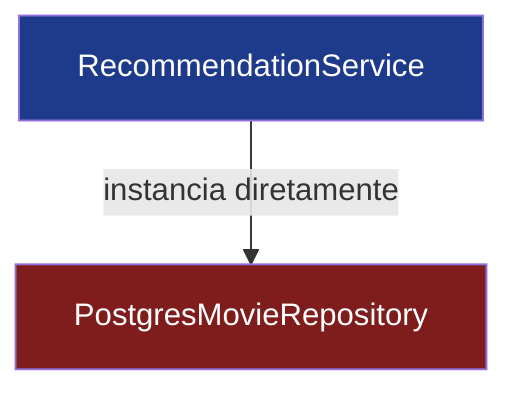
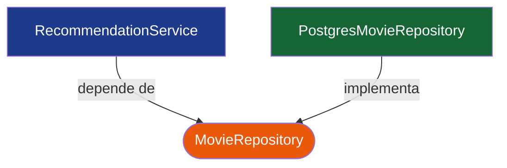
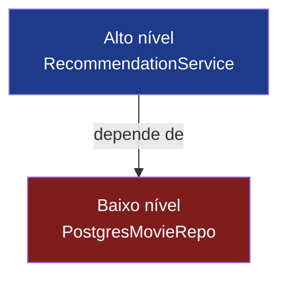
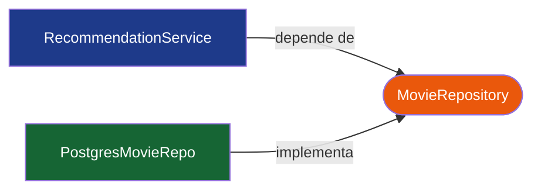
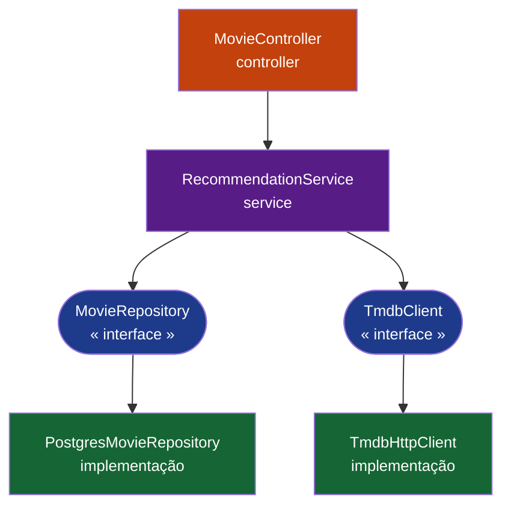

# Princípio da Inversão de Dependência ou *DIP*

O "D" de **SOLID**

<div class="abs-br m-6 text-right text-xs opacity-60 leading-5">
  Engenharia de Software · Engenharia de Computação<br/>
  Facens · 2026
</div>

---
layout: intro
---

# Apresentação do Grupo

<div class="grid grid-cols-2 gap-6 pt-2">

<div v-click class="border border-gray-500 border-opacity-30 rounded-lg p-6 transition-all duration-300">
  <carbon:user-avatar class="text-3xl mb-2 text-orange-400"/>
  <h3>Pedro Salviano Santos</h3>
  <p class="opacity-70 text-sm">Tech Lead, Backend, Arquitetura & DevOps</p>
</div>

<div v-click class="border border-gray-500 border-opacity-30 rounded-lg p-6 transition-all duration-300">
  <carbon:user-avatar class="text-3xl mb-2 text-orange-400"/>
  <h3>Luiz Gustavo Motta Viana</h3>
  <p class="opacity-70 text-sm">Product Owner & QA</p>
</div>

<div v-click class="border border-gray-500 border-opacity-30 rounded-lg p-6 transition-all duration-300">
  <carbon:user-avatar class="text-3xl mb-2 text-orange-400"/>
  <h3>Erick Ferreira Ribeiro</h3>
  <p class="opacity-70 text-sm">Scrum Master, Frontend</p>
</div>

<div v-click class="border border-gray-500 border-opacity-30 rounded-lg p-6 transition-all duration-300">
  <carbon:user-avatar class="text-3xl mb-2 text-orange-400"/>
  <h3>Felipe Matias de Jesus</h3>
  <p class="opacity-70 text-sm">Backend</p>
</div>

</div>

<div class="pt-8 text-sm opacity-60">
  <strong>Projeto:</strong> watchToNext — plataforma de recomendação de filmes baseada em KNN
</div>

---
layout: section
---

# 01

## O Princípio

<div class="text-sm opacity-70 pt-4">Que problema ele resolve?</div>

---
layout: default
---

# De onde ele vem?

<div class="grid grid-cols-2 gap-8 pt-4">

<div>

**SOLID** — cinco princípios de design orientado a objetos formulados por **Robert C. Martin** (Uncle Bob) no início dos anos 2000.

<v-clicks>

- **S** — Responsabilidade Única
- **O** — Aberto / Fechado
- **L** — Substituição de Liskov
- **I** — Segregação de Interface
- <span class="text-orange-400 font-bold">D — **Inversão de Dependência**</span>

</v-clicks>

</div>

<div v-click class="border-l-4 border-orange-400 pl-4 italic opacity-90 self-center">

  "Módulos de alto nível não devem depender de módulos de baixo nível.
  Ambos devem depender de abstrações."

  <div class="text-xs opacity-60 not-italic mt-3">— Robert C. Martin, <em>The Dependency Inversion Principle</em>, C++ Report, 1996</div>
</div>

</div>

---
layout: default
---

# Por que o acoplamento importa?

<div class="grid grid-cols-2 gap-8 pt-2">

<div v-click class="flex flex-col">

### ❌ Acoplamento forte

<div class="h-44">



</div>

<div class="text-sm space-y-1 mt-1">
  <div>Trocar o banco → reescrever o serviço.</div>
  <div>Testar → precisa de Postgres rodando.</div>
</div>

<div class="mt-4 p-3 bg-red-500 bg-opacity-10 border border-red-400 border-opacity-40 rounded text-sm">
  <carbon:warning class="inline text-red-400"/> Mudança em um lugar quebra o outro
</div>

</div>

<div v-click class="flex flex-col">

### ✅ Acoplamento fraco

<div class="h-44">



</div>

<div class="text-sm space-y-1 mt-1">
  <div>Trocar o banco → nova implementação.</div>
  <div>Testar → um fake em memória resolve.</div>
</div>

<div class="mt-4 p-3 bg-green-500 bg-opacity-10 border border-green-400 border-opacity-40 rounded text-sm">
  <carbon:checkmark class="inline text-green-400"/> Cada lado evolui de forma independente
</div>

</div>

</div>

---
layout: section
---

# 02

## Definição Técnica

---

# As duas regras do DIP

<div class="grid grid-cols-2 gap-6 pt-3">

<div v-click class="p-5 border border-orange-400 border-opacity-50 rounded-lg bg-orange-500 bg-opacity-5">
  <div class="flex items-center gap-2 mb-3">
    <span class="text-orange-400 font-mono text-xs font-bold tracking-widest">REGRA 1</span>
    <div class="flex-1 h-px bg-orange-400 opacity-30"/>
  </div>
  <p class="font-semibold mb-2">Módulos de alto nível não devem depender de módulos de baixo nível.</p>
  <p class="text-sm opacity-75">Ambos devem depender de <strong>abstrações</strong>.</p>
  <div class="mt-4 text-xs opacity-60 flex items-start gap-2">
    <carbon:idea class="text-orange-400 flex-shrink-0 mt-0.5"/>
    <span>A lógica de negócio não deve conhecer detalhes de banco, HTTP ou framework.</span>
  </div>
</div>

<div v-click class="p-5 border border-purple-400 border-opacity-50 rounded-lg bg-purple-500 bg-opacity-5">
  <div class="flex items-center gap-2 mb-3">
    <span class="text-purple-400 font-mono text-xs font-bold tracking-widest">REGRA 2</span>
    <div class="flex-1 h-px bg-purple-400 opacity-30"/>
  </div>
  <p class="font-semibold mb-2">Abstrações não devem depender de detalhes.</p>
  <p class="text-sm opacity-75">Detalhes devem depender de <strong>abstrações</strong>.</p>
  <div class="mt-4 text-xs opacity-60 flex items-start gap-2">
    <carbon:idea class="text-purple-400 flex-shrink-0 mt-0.5"/>
    <span>A interface <code>MovieRepository</code> não deve expor nada do JDBC — ela define o contrato, não a implementação.</span>
  </div>
</div>

</div>

<div v-click class="mt-5 p-4 bg-gray-500 bg-opacity-5 border border-gray-500 border-opacity-20 rounded flex items-start gap-3 text-sm">
  <carbon:code class="text-orange-400 text-xl flex-shrink-0 mt-0.5"/>
  <div>
    Em <strong>Kotlin / Java</strong>, "abstração" significa uma <code>interface</code> ou <code>classe abstrata</code>.
    O módulo de alto nível depende do tipo abstrato; o contêiner IoC injeta a implementação concreta em tempo de execução.
  </div>
</div>

---

# Invertendo a dependência

<div class="grid grid-cols-2 gap-4 pt-1">

<div v-click class="flex flex-col p-4 border border-red-400 border-opacity-40 rounded-lg bg-red-500 bg-opacity-5">
  <div class="flex items-center gap-2 mb-2">
    <carbon:arrow-down class="text-red-400"/>
    <span class="font-semibold">Fluxo tradicional</span>
    <div class="flex-1 h-px bg-red-400 opacity-20"/>
  </div>

  <div class="h-44">



  </div>

  <div class="text-sm mt-2 pt-4">O serviço <strong>conhece</strong> o Postgres diretamente.</div>
  <div class="mt-auto pt-2 text-sm flex items-start gap-2">
    <carbon:warning class="text-red-400 flex-shrink-0 mt-0.5"/>
    <span>Trocar o banco obriga a reescrever o serviço. Testar exige infraestrutura real.</span>
  </div>
</div>

<div v-click class="flex flex-col p-4 border border-orange-400 border-opacity-40 rounded-lg bg-orange-500 bg-opacity-5">
  <div class="flex items-center gap-2 mb-2">
    <carbon:arrow-up class="text-orange-400"/>
    <span class="font-semibold">Fluxo invertido</span>
    <div class="flex-1 h-px bg-orange-400 opacity-20"/>
  </div>

  <div class="h-44 overflow-hidden">



  </div>

  <div class="text-sm mt-2">Ambos dependem da <strong>abstração</strong> — o serviço não sabe que o Postgres existe.</div>
  <div class="mt-auto pt-2 text-sm flex items-start gap-2">
    <carbon:checkmark class="text-green-400 flex-shrink-0 mt-0.5"/>
    <span>Trocar a implementação não altera o serviço. Testar com um fake em memória.</span>
  </div>
</div>

</div>

<div v-click class="mt-2 p-2 bg-gray-500 bg-opacity-5 border border-gray-500 border-opacity-20 rounded text-sm text-center">
  A seta que antes apontava <em>para baixo</em> agora aponta <em>para a abstração</em> — daí o nome <strong>inversão</strong>.
</div>

---

# DIP vs. Injeção de Dependência

<div class="grid grid-cols-2 gap-6 pt-3">

<div v-click class="flex flex-col p-5 border border-purple-400 border-opacity-50 rounded-lg bg-purple-500 bg-opacity-5">
  <div class="flex items-center gap-2 mb-3">
    <carbon:idea class="text-purple-400 text-xl"/>
    <span class="font-mono text-xs font-bold tracking-widest text-purple-400">PRINCÍPIO</span>
    <div class="flex-1 h-px bg-purple-400 opacity-30"/>
  </div>
  <p class="font-semibold text-base mb-2">Inversão de Dependência</p>
  <p class="text-sm">Trata da <strong>direção</strong> das setas de dependência na arquitetura. Define <em>quem</em> depende de <em>quem</em>.</p>
  <div class="mt-auto pt-4 text-sm flex items-start gap-2">
    <carbon:network-4 class="text-purple-400 flex-shrink-0 mt-0.5"/>
    <span>É uma decisão de <strong>design</strong> — tomada na hora de modelar as camadas do sistema.</span>
  </div>
</div>

<div v-click class="flex flex-col p-5 border border-orange-400 border-opacity-50 rounded-lg bg-orange-500 bg-opacity-5">
  <div class="flex items-center gap-2 mb-3">
    <carbon:tool-kit class="text-orange-400 text-xl"/>
    <span class="font-mono text-xs font-bold tracking-widest text-orange-400">TÉCNICA</span>
    <div class="flex-1 h-px bg-orange-400 opacity-30"/>
  </div>
  <p class="font-semibold text-base mb-2">Injeção de Dependência</p>
  <p class="text-sm">Uma forma de <strong>fornecer</strong> dependências em tempo de execução — via construtor, setter ou framework.</p>
  <div class="mt-auto pt-4 text-sm flex items-start gap-2">
    <carbon:settings class="text-orange-400 flex-shrink-0 mt-0.5"/>
    <span>É um <strong>mecanismo</strong> — como o Spring resolve qual implementação injetar.</span>
  </div>
</div>

</div>

<div v-click class="mt-4 p-4 bg-gray-500 bg-opacity-5 border border-gray-500 border-opacity-20 rounded text-sm flex items-start gap-3">
  <carbon:warning-alt class="text-orange-400 text-xl flex-shrink-0 mt-0.5"/>
  <div>
    Dá pra ter <strong>injeção sem inversão</strong> (injetar uma classe concreta) e <strong>inversão sem injeção</strong> (instanciar manualmente via factory).
    No Spring, o <code>@Autowired</code> faz DI — o serviço depender de <code>MovieRepository</code> é DIP.
  </div>
</div>

---
layout: section
---

# 03

## Exemplos de Código

---

# ❌ Violando o DIP

<div class="text-sm mb-2">Serviço de alto nível instanciando diretamente uma classe concreta.</div>

```kotlin {all|2-3|6-9|all}
class RecommendationService {
    // Acoplamento forte: o serviço conhece a implementação exata do banco
    private val repo = PostgresMovieRepository()

    fun recommendFor(userId: Long): List<Movie> {
        val watched = repo.findWatchedByUser(userId)
        // ... lógica do KNN ...
        return repo.findSimilar(watched)
    }
}

class PostgresMovieRepository {
    fun findWatchedByUser(userId: Long): List<Movie> { /* JDBC */ }
    fun findSimilar(seed: List<Movie>): List<Movie> { /* JDBC */ }
}
```

<div class="flex gap-3 pt-3">

<div v-click class="flex-1 p-3 border border-red-400 border-opacity-40 rounded-lg bg-red-500 bg-opacity-5 flex items-start gap-2 text-sm">
  <carbon:warning class="text-red-400 flex-shrink-0 mt-0.5"/>
  <div><strong>Acoplamento forte</strong> — o serviço conhece a classe concreta do banco.</div>
</div>

<div v-click class="flex-1 p-3 border border-red-400 border-opacity-40 rounded-lg bg-red-500 bg-opacity-5 flex items-start gap-2 text-sm">
  <carbon:close-outline class="text-red-400 flex-shrink-0 mt-0.5"/>
  <div>Trocar o banco exige <strong>reescrever o serviço</strong>.</div>
</div>

<div v-click class="flex-1 p-3 border border-red-400 border-opacity-40 rounded-lg bg-red-500 bg-opacity-5 flex items-start gap-2 text-sm">
  <carbon:close-outline class="text-red-400 flex-shrink-0 mt-0.5"/>
  <div>Testar requer um <strong>Postgres real</strong> — sem fakes possíveis.</div>
</div>

</div>

---

# ✅ Aplicando o DIP

<div class="text-sm mb-2">Dependa de uma abstração e injete a implementação.</div>

```kotlin {all|1-4|7|10-13|all}
interface MovieRepository {
    fun findWatchedByUser(userId: Long): List<Movie>
    fun findSimilar(seed: List<Movie>): List<Movie>
}

@Service
class RecommendationService(private val repo: MovieRepository) {
    fun recommendFor(userId: Long): List<Movie> {
        val watched = repo.findWatchedByUser(userId)
        return repo.findSimilar(watched)
    }
}

@Repository
class PostgresMovieRepository : MovieRepository { /* JDBC */ }
```

<div class="flex gap-3 pt-3">

<div v-click class="flex-1 p-3 border border-green-400 border-opacity-40 rounded-lg bg-green-500 bg-opacity-5 flex items-start gap-2 text-sm">
  <carbon:checkmark class="text-green-400 flex-shrink-0 mt-0.5"/>
  <div><strong>Acoplamento fraco</strong> — o serviço depende apenas da interface.</div>
</div>

<div v-click class="flex-1 p-3 border border-green-400 border-opacity-40 rounded-lg bg-green-500 bg-opacity-5 flex items-start gap-2 text-sm">
  <carbon:checkmark class="text-green-400 flex-shrink-0 mt-0.5"/>
  <div>Trocar o banco é só <strong>uma nova implementação</strong> — zero mudanças no serviço.</div>
</div>

<div v-click class="flex-1 p-3 border border-green-400 border-opacity-40 rounded-lg bg-green-500 bg-opacity-5 flex items-start gap-2 text-sm">
  <carbon:checkmark class="text-green-400 flex-shrink-0 mt-0.5"/>
  <div>Testar com um <strong>fake em memória</strong> — sem infraestrutura real.</div>
</div>

</div>

---

# A mesma ideia em Java

```java {all|1-4|6-13|all}
public interface MovieRepository {
    List<Movie> findWatchedByUser(Long userId);
    List<Movie> findSimilar(List<Movie> seed);
}

@Service
public class RecommendationService {
    private final MovieRepository repo;

    public RecommendationService(MovieRepository repo) {
        this.repo = repo;  // injetado, não instanciado
    }

    public List<Movie> recommendFor(Long userId) {
        return repo.findSimilar(repo.findWatchedByUser(userId));
    }
}
```

<div class="flex gap-3 pt-3">

<div v-click class="flex-1 p-3 border border-orange-400 border-opacity-40 rounded-lg bg-orange-500 bg-opacity-5 flex items-start gap-2 text-sm">
  <carbon:settings class="text-orange-400 flex-shrink-0 mt-0.5"/>
  <div><strong>IoC (Inversion of Control)</strong> — em vez de o serviço criar suas dependências, um contêiner externo as cria e injeta. O controle é invertido.</div>
</div>

<div v-click class="flex-1 p-3 border border-green-400 border-opacity-40 rounded-lg bg-green-500 bg-opacity-5 flex items-start gap-2 text-sm">
  <carbon:checkmark class="text-green-400 flex-shrink-0 mt-0.5"/>
  <div>O Spring resolve <code>MovieRepository</code> em tempo de execução e injeta a implementação concreta — o serviço nunca a menciona diretamente.</div>
</div>

</div>

---

# Fácil de testar

<div class="text-xs font-mono text-purple-400 mb-2 tracking-widest">MOCKITO + JUNIT 5</div>

```kotlin {all|1-3|6-8|10|all}
@ExtendWith(MockitoExtension::class)
class RecommendationServiceTest {
    @Mock lateinit var repo: MovieRepository

    @Test
    fun `recomenda filmes similares`() {
        `when`(repo.findWatchedByUser(42L)).thenReturn(listOf(Movie(1, "A Origem")))
        `when`(repo.findSimilar(any())).thenReturn(listOf(Movie(2, "Interestelar")))
        val result = RecommendationService(repo).recommendFor(42L)
        assertEquals("Interestelar", result.first().title)
    }
}
```

<div class="flex gap-3 pt-3">

<div v-click class="flex-1 p-3 border border-purple-400 border-opacity-40 rounded-lg bg-purple-500 bg-opacity-5 flex items-start gap-2 text-sm">
  <carbon:at class="text-purple-400 flex-shrink-0 mt-0.5"/>
  <div><code>@Mock</code> pede ao Mockito para criar um proxy de <code>MovieRepository</code> — nenhum banco é instanciado.</div>
</div>

<div v-click class="flex-1 p-3 border border-purple-400 border-opacity-40 rounded-lg bg-purple-500 bg-opacity-5 flex items-start gap-2 text-sm">
  <carbon:code class="text-purple-400 flex-shrink-0 mt-0.5"/>
  <div><code>when(...).thenReturn(...)</code> define o comportamento esperado sem tocar em infraestrutura real.</div>
</div>

<div v-click class="flex-1 p-3 border border-green-400 border-opacity-40 rounded-lg bg-green-500 bg-opacity-5 flex items-start gap-2 text-sm">
  <carbon:checkmark class="text-green-400 flex-shrink-0 mt-0.5"/>
  <div>Isso só é possível porque <code>MovieRepository</code> é uma <strong>interface</strong> — o DIP em ação.</div>
</div>

</div>

---
layout: section
---

# 04

## Como aplicamos
## no **watchToNext**

---

# A arquitetura

<div class="grid grid-cols-5 gap-4 pt-2">

<div class="col-span-2 flex flex-col gap-1.5">

<div v-click class="p-2 border border-orange-400 border-opacity-40 rounded-lg bg-orange-500 bg-opacity-5 flex items-start gap-2">
  <carbon:api class="text-base text-orange-400 flex-shrink-0 mt-0.5"/>
  <div>
    <strong class="text-sm">Controller</strong>
    <p class="text-xs mt-0.5">Camada HTTP fina — recebe a requisição e delega ao serviço. Sem lógica de negócio.</p>
  </div>
</div>

<div v-click class="p-2 border border-purple-400 border-opacity-40 rounded-lg bg-purple-500 bg-opacity-5 flex items-start gap-2">
  <carbon:cognitive class="text-base text-purple-400 flex-shrink-0 mt-0.5"/>
  <div>
    <strong class="text-sm">Service</strong>
    <p class="text-xs mt-0.5">Toda a lógica de negócio — KNN, ranking, enriquecimento. Depende exclusivamente de <em>interfaces</em>.</p>
  </div>
</div>

<div v-click class="p-2 border border-green-400 border-opacity-40 rounded-lg bg-green-500 bg-opacity-5 flex items-start gap-2">
  <carbon:data-base class="text-base text-green-400 flex-shrink-0 mt-0.5"/>
  <div>
    <strong class="text-sm">Repository / Integration</strong>
    <p class="text-xs mt-0.5">Postgres e API do TMDB — implementam as interfaces. O serviço nunca os conhece diretamente.</p>
  </div>
</div>

</div>

<div v-click class="col-span-3 flex items-center justify-center">



</div>

</div>

---

# Exemplo 1 — Integração com o TMDB

<div class="text-sm mb-2">O serviço depende de um <strong>contrato</strong>, não de uma API específica. Trocar TMDB por OMDb é só uma nova implementação.</div>

```kotlin {all|1-5|7-11|13-22}
// Contrato: define O QUE o serviço precisa — sem mencionar HTTP ou TMDB
interface MovieMetadataClient {
    fun fetchById(externalId: String): MovieMetadata
    fun search(query: String): List<MovieMetadata>
}

// Serviço de alto nível: recebe a interface, nunca a implementação concreta
@Service
class MovieService(private val metadata: MovieMetadataClient) {
    fun enrich(movie: Movie) = metadata.fetchById(movie.tmdbId)
}

// Implementação concreta: sabe como chamar o TMDB via HTTP
// Pode ser substituída por OMDbClient sem alterar MovieService
@Component
class TmdbHttpClient(
    private val webClient: WebClient,
    @Value("\${tmdb.api-key}") private val apiKey: String,
) : MovieMetadataClient {
    override fun fetchById(externalId: String): MovieMetadata { /* HTTP GET /movie/{id} */ }
    override fun search(query: String): List<MovieMetadata> { /* HTTP GET /search/movie */ }
}
```

---

# Exemplo 2 — Estratégia de recomendação

<div class="text-sm mb-2">O algoritmo de recomendação é trocável via <strong>Spring Profile</strong> — o serviço não sabe qual está rodando.</div>

```kotlin {all|1-4|6-10|12-18}
// Contrato: define apenas O QUE a estratégia faz, não como
interface RecommendationStrategy {
    fun recommend(userId: Long, watched: List<Movie>): List<Movie>
}

// Serviço de alto nível: delega 100% para a estratégia injetada
@Service
class RecommendationService(private val strategy: RecommendationStrategy) {
    fun recommendFor(userId: Long, watched: List<Movie>) = strategy.recommend(userId, watched)
}

// Implementação padrão — ativa no perfil "default"
@Component @Profile("default")
class KnnStrategy(private val repo: MovieRepository) : RecommendationStrategy { /* KNN */ }

// Implementação experimental — ativada via SPRING_PROFILES_ACTIVE=experiment
@Component @Profile("experiment")
class CollaborativeFilteringStrategy(...) : RecommendationStrategy { /* CF */ }
```

---

# O que ganhamos com isso

<div class="grid grid-cols-2 gap-6 pt-6">

<div v-click class="p-5 border border-gray-500 border-opacity-30 rounded">
  <carbon:test-tool class="text-2xl text-orange-400 mb-2"/>
  <strong>Testabilidade</strong>
  <p class="text-sm opacity-80 mt-2">Os serviços são testados com fakes em memória. Sem chamadas a Postgres ou TMDB no CI.</p>
</div>

<div v-click class="p-5 border border-gray-500 border-opacity-30 rounded">
  <carbon:reset class="text-2xl text-purple-400 mb-2"/>
  <strong>Substituibilidade</strong>
  <p class="text-sm opacity-80 mt-2">Trocar TMDB por OMDb é só uma nova implementação de <code>MovieMetadataClient</code> — zero mudanças no serviço.</p>
</div>

<div v-click class="p-5 border border-gray-500 border-opacity-30 rounded">
  <carbon:flash class="text-2xl text-yellow-400 mb-2"/>
  <strong>Experimentação</strong>
  <p class="text-sm opacity-80 mt-2">Testes A/B de estratégias de recomendação via profiles do Spring, sem mexer no controller nem no serviço.</p>
</div>

<div v-click class="p-5 border border-gray-500 border-opacity-30 rounded">
  <carbon:layers class="text-2xl text-green-400 mb-2"/>
  <strong>Fronteiras claras</strong>
  <p class="text-sm opacity-80 mt-2">A lógica de domínio não vaza para a infraestrutura. Cada camada tem um único motivo para mudar.</p>
</div>

</div>

---
layout: center
class: text-center
---

# Resumo

<div class="pt-6 space-y-4 text-left max-w-2xl mx-auto">

<v-clicks>

<div class="flex items-start gap-3">
  <carbon:arrow-right class="text-orange-400 text-xl mt-1 flex-shrink-0"/>
  <div>Dependa de <strong>abstrações</strong>, não de implementações concretas.</div>
</div>

<div class="flex items-start gap-3">
  <carbon:arrow-right class="text-orange-400 text-xl mt-1 flex-shrink-0"/>
  <div>Inverta a seta de dependência — a política de alto nível define a interface.</div>
</div>

<div class="flex items-start gap-3">
  <carbon:arrow-right class="text-orange-400 text-xl mt-1 flex-shrink-0"/>
  <div>DIP é o <em>princípio</em>; DI é uma técnica para alcançá-lo.</div>
</div>

<div class="flex items-start gap-3">
  <carbon:arrow-right class="text-orange-400 text-xl mt-1 flex-shrink-0"/>
  <div>O retorno: testabilidade, substituibilidade e fronteiras limpas.</div>
</div>

</v-clicks>

</div>

---
layout: section
---

# 05

## Referências

---

# Referências

<div class="grid grid-cols-2 gap-3 pt-2">

  <div class="p-3 border border-orange-400 border-opacity-40 rounded-lg bg-orange-500 bg-opacity-5 flex items-start gap-3">
    <carbon:book class="text-xl text-orange-400 flex-shrink-0 mt-0.5"/>
    <div>
      <div class="text-xs font-mono text-orange-400 tracking-widest mb-1">ARTIGO ORIGINAL</div>
      <div class="text-sm font-semibold">The Dependency Inversion Principle</div>
      <div class="text-xs mt-1">Martin, R. C. · C++ Report · 1996</div>
    </div>
  </div>

  <div class="p-3 border border-green-400 border-opacity-40 rounded-lg bg-green-500 bg-opacity-5 flex items-start gap-3">
    <carbon:document class="text-xl text-green-400 flex-shrink-0 mt-0.5"/>
    <div>
      <div class="text-xs font-mono text-green-400 tracking-widest mb-1">ARTIGO</div>
      <div class="text-sm font-semibold">Inversion of Control Containers and the Dependency Injection Pattern</div>
      <div class="text-xs mt-1">Fowler, M. · martinfowler.com · 2004</div>
    </div>
  </div>

  <div class="p-3 border border-purple-400 border-opacity-40 rounded-lg bg-purple-500 bg-opacity-5 flex items-start gap-3">
    <carbon:book class="text-xl text-purple-400 flex-shrink-0 mt-0.5"/>
    <div>
      <div class="text-xs font-mono text-purple-400 tracking-widest mb-1">LIVRO</div>
      <div class="text-sm font-semibold">Clean Architecture</div>
      <div class="text-xs mt-1">Martin, R. C. · Prentice Hall · 2017</div>
    </div>
  </div>

  <div class="p-3 border border-gray-400 border-opacity-40 rounded-lg bg-gray-500 bg-opacity-5 flex items-start gap-3">
    <carbon:document class="text-xl text-gray-400 flex-shrink-0 mt-0.5"/>
    <div>
      <div class="text-xs font-mono text-gray-400 tracking-widest mb-1">DOCUMENTAÇÃO</div>
      <div class="text-sm font-semibold">Spring Framework — The IoC Container</div>
      <div class="text-xs mt-1">docs.spring.io · Spring 6.x</div>
    </div>
  </div>

  <div class="p-3 border border-purple-400 border-opacity-40 rounded-lg bg-purple-500 bg-opacity-5 flex items-start gap-3">
    <carbon:book class="text-xl text-purple-400 flex-shrink-0 mt-0.5"/>
    <div>
      <div class="text-xs font-mono text-purple-400 tracking-widest mb-1">LIVRO</div>
      <div class="text-sm font-semibold">Clean Code</div>
      <div class="text-xs mt-1">Martin, R. C. · Prentice Hall · 2008</div>
    </div>
  </div>

  <div class="p-3 border border-gray-400 border-opacity-40 rounded-lg bg-gray-500 bg-opacity-5 flex items-start gap-3">
    <carbon:document class="text-xl text-gray-400 flex-shrink-0 mt-0.5"/>
    <div>
      <div class="text-xs font-mono text-gray-400 tracking-widest mb-1">DOCUMENTAÇÃO</div>
      <div class="text-sm font-semibold">Kotlin — Interfaces & Abstract Classes</div>
      <div class="text-xs mt-1">kotlinlang.org · Kotlin 2.x</div>
    </div>
  </div>

</div>

---
layout: center
class: text-center
---

# Obrigado!

<div class="text-lg opacity-80 pt-4">Perguntas?</div>

<div class="pt-12 text-sm opacity-60">
  Engenharia de Software e Princípios · watchToNext · 2026
</div>
